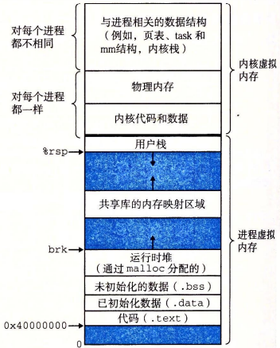
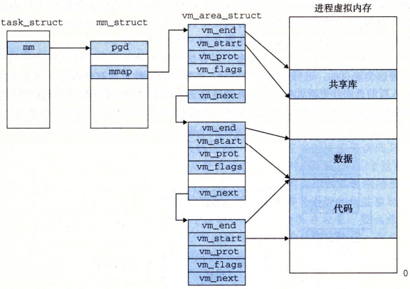

# 进程地址空间


## 虚拟地址
Linux 为每个进程维护了一个单独的虚拟地址空间，可分为内核虚拟内存和进程虚拟内存。Linux 将虚拟内存组织成一些区域（也叫做段）的集合，一个区域就是就是已经分配的虚拟内存的连续片。每个存在的虚拟页面都保存在某个区域中，而不属于某个区域的虚拟页是不存在的，且不能被进程引用。




内核为系统中的每个进程维护一个单独的 task_struct，任务结构中的一个条目指向 mm_struct，它描述了虚拟内存的当前状态。



OS 给进程预留了堆和地址映射两个虚拟内存区域供进程自己申请使用。分别提供了 brk() 和 mmap() 系统调用以申请内存，为进程添加额外的虚拟内存。虚拟内存和物理内存的分配并不是同步进行，只有在真正访问一个地址时才分配相应的物理内存，并建立虚拟内存和物理内存两者间的映射。

## 堆空间管理
brk() 函数是系统调用，用以向操作系统申请堆内存区域。函数原型如下（头文件 <unistd.h>）：
```
int brk(void *addr);
```
brk() 函数仅仅移动 brk 指针，如果成功，函数返回 0，否则，函数返回 -1。

另外 C 库函数 sbrk() 对 brk() 函数进行了封装，提供了更复杂的功能，函数原型如下（头文件 <unistd.h>）：
```
void *sbrk(intptr_t increment);
```
sbrk() 函数增加或者回收进程堆空间（字节）。当 increment 为正数时扩展 brk 值；当 increment 为负值时收缩 brk 值；当 increment 为 0，返回当前栈顶位置。如果成功，sbrk() 返回移动前 brk 所标记的地址。若出错，函数返回 (void*)-1。

比如如下代码
```
#include <unistd.h>
#include <stdio.h>

int main() {
  void* pos = sbrk(0);
  printf("pos  = 0x%x\n", pos);

  int* ptr = (int*)pos;
  brk(ptr + 4);
  void* pos2 = sbrk(0);
  printf("pos2 = 0x%x\n", pos2);

  sbrk(4);
  void* pos3 = sbrk(0);
  printf("pos3 = 0x%x\n", pos3);
  return 0;
}
```
可能输出为
```
pos  = 0x55267000
pos2 = 0x55267010
pos3 = 0x55267014
```

## 地址映射
mmap() 函数将一个文件或者其他对象映射进内存。函数原型如下（头文件 <sys/mman.h>）：
```
void *mmap(void *start, size_t length, int prot, int flags, int fd, off_t offset);
```
mmap() 函数要求创建的虚拟内存的地址最好是从 start 开始的一个区域，并将文件描述符 fd 指定的对象（fd 可以为 -1）的一个连续的片映射到这个新的区域。连续的对象片大小为 length 字节，从距文件开始处偏移量为 offset 字节的地方开始。start 地址仅仅是一个暗示，通常被定义为 NULL。如果成功，返回映射内存起始地址；失败则返回 (void*)-1。

参数 prot 包含描述新映射的虚拟内存区域的访问权限位，可以指定以下权限：
- PROT_EXEC：这个区域的页面由可以被 CPU 执行的指令组成
- PROT_READ：这个区域内的页面可读
- PROT_WRITE：这个区域内的页面可写
- PROT_NONE：这个区域内的页面不能被访问

flags 描述被映射对象类型的位组成。有如下标志：
- MAP_ANON：被映射的对象是一个匿名对象，相应的虚拟页面是请求二进制零的
- MAP_PRIVATE：被映射的对象是一个私有的、写时复制的对象
- MAP_SHARED：被映射的是一个共享对象

函数 munmap() 执行相反的过程，解除内存映射。函数原型如下（头文件 <sys/mman.h>）：
```
int munmap(void *start, size_t length);
```
成功返回 0，否则，函数返回 -1。

另外，mremap() 函数可以将 mmap 返回的地址空间，重新 mmap 以拓展或者收缩地址空间
```
void *mremap (void *old_addr, size_t old_len, size_t new_len,
		     int flags, .../* new_addr */)
```
参数 flag 可以为 0，也可以包含如下值：
- MREMAP_MAYMOVE：返回的起始地址可以不同于 old_addr
- MREMAP_DONTUNMAP：如果 MOVE，不对 old_addr 地址空间执行 munmap