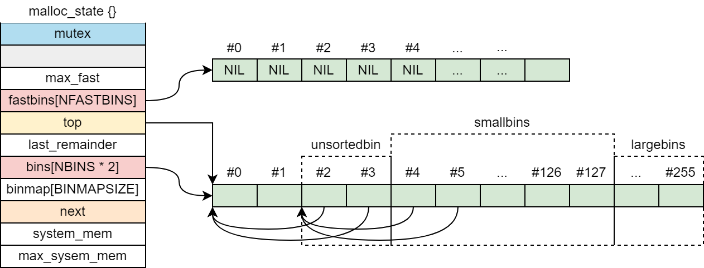

## 进程地址空间


### 虚拟地址
Linux 为每个进程维护了一个单独的虚拟地址空间，可分为内核虚拟内存和进程虚拟内存。Linux 将虚拟内存组织成一些区域（也叫做段）的集合，一个区域就是就是已经分配的虚拟内存的连续片。每个存在的虚拟页面都保存在某个区域中，而不属于某个区域的虚拟页是不存在的，且不能被进程引用。


内核为系统中的每个进程维护一个单独的 task_struct，任务结构中的一个条目指向 mm_struct，它描述了虚拟内存的当前状态。


OS 给进程预留了堆和地址映射两个虚拟内存区域供进程自己申请使用。分别提供了 brk() 和 mmap() 系统调用以申请内存，为进程添加额外的虚拟内存。虚拟内存和物理内存的分配并不是同步进行，只有在真正访问一个地址时才分配相应的物理内存，并建立虚拟内存和物理内存两者间的映射。

### 堆空间管理
brk() 函数是系统调用，用以向操作系统申请堆内存区域。函数原型如下（头文件 <unistd.h>）：
```
int brk(void *addr);
```
brk() 函数仅仅移动 brk 指针，如果成功，函数返回 0，否则，函数返回 -1。

另外 C 库函数 sbrk() 对 brk() 函数进行了封装，提供了更复杂的功能，函数原型如下（头文件 <unistd.h>）：
```
void *sbrk(intptr_t increment);
```
sbrk() 函数增加或者回收进程堆空间（字节）。当 increment 为正数时扩展 brk 值；当 increment 为负值时收缩 brk 值；当 increment 为 0，返回当前栈顶位置。如果成功，sbrk() 返回移动前 brk 所标记的地址。若出错，函数返回 (void*)-1。

比如如下代码
```
#include <unistd.h>
#include <stdio.h>

int main() {
  void* pos = sbrk(0);
  printf("pos  = 0x%x\n", pos);

  int* ptr = (int*)pos;
  brk(ptr + 4);
  void* pos2 = sbrk(0);
  printf("pos2 = 0x%x\n", pos2);

  sbrk(4);
  void* pos3 = sbrk(0);
  printf("pos3 = 0x%x\n", pos3);
  return 0;
}
```
可能输出为
```
pos  = 0x55267000
pos2 = 0x55267010
pos3 = 0x55267014
```

### 地址映射
mmap() 函数将一个文件或者其他对象映射进内存。函数原型如下（头文件 <sys/mman.h>）：
```
void *mmap(void *start, size_t length, int prot, int flags, int fd, off_t offset);
```
mmap() 函数要求创建的虚拟内存的地址最好是从 start 开始的一个区域，并将文件描述符 fd 指定的对象（fd 可以为 -1）的一个连续的片映射到这个新的区域。连续的对象片大小为 length 字节，从距文件开始处偏移量为 offset 字节的地方开始。start 地址仅仅是一个暗示，通常被定义为 NULL。如果成功，返回映射内存起始地址；失败则返回 (void*)-1。

参数 prot 包含描述新映射的虚拟内存区域的访问权限位，可以指定以下权限：
- PROT_EXEC：这个区域的页面由可以被 CPU 执行的指令组成
- PROT_READ：这个区域内的页面可读
- PROT_WRITE：这个区域内的页面可写
- PROT_NONE：这个区域内的页面不能被访问

flags 描述被映射对象类型的位组成。有如下标志：
- MAP_ANON：被映射的对象是一个匿名对象，相应的虚拟页面是请求二进制零的
- MAP_PRIVATE：被映射的对象是一个私有的、写时复制的对象
- MAP_SHARED：被映射的是一个共享对象

函数 munmap() 执行相反的过程，解除内存映射。函数原型如下（头文件 <sys/mman.h>）：
```
int munmap(void *start, size_t length);
```
成功返回 0，否则，函数返回 -1。

另外，mremap() 函数可以将 mmap 返回的地址空间，重新 mmap 以拓展或者收缩地址空间
```
void *mremap (void *old_addr, size_t old_len, size_t new_len,
		     int flags, .../* new_addr */)
```
参数 flag 可以为 0，也可以包含如下值：
- MREMAP_MAYMOVE：返回的起始地址可以不同于 old_addr
- MREMAP_DONTUNMAP：如果 MOVE，不对 old_addr 地址空间执行 munmap

## 设计哲学
glibc 早期 malloc 采用的是 Doug Lea 实现的 dlmalloc，但是不支持多线程操作。Wolfram Gloger 在 dlmalloc 基础开发出了支持多线程的 ptmalloc。glibc-2.3.x 集成了 ptmalloc2，就是我们平时使用的 malloc。

malloc 处于用户程序和系统之间，他响应用户程序内存申请请求，然后向操作系统申请内存，最后将其返回给用户程序。为了保持高效，malloc 一般向系统一次申请一块远大于用户程序请求的内存，然后托管剩余的内存。用户程序下一次申请内存时，可以直接使用托管的内存而不需要再从系统申请。用户程序释放的内存也不是立即返回给系统，malloc 会暂时管理这里释放的内存，以应对用户进程下一次内存分配请求。

### chunk
ptmalloc2 使用 chunk 来组织内存。
```
struct malloc_chunk {
  INTERNAL_SIZE_T prev_size; // 前一个 chunk 大小
  INTERNAL_SIZE_T size;      // 当前 chunk 大小

  struct malloc_chunk* fd;   // 双向链表，用于管理 chunk
  struct malloc_chunk* bk;
};
```


size 成员低三位用于标记：1）前一个 chunk 正在使用；2）mmap 映射内存；3）属于 non_main_arena
```
#define PREV_INUSE 0x1
#define prev_inuse(p) ((p)->size & PREV_INUSE)

#define IS_MMAPPED 0x2
#define chunk_is_mmapped(p) ((p)->size & IS_MMAPPED)

#define NON_MAIN_ARENA 0x4
#define chunk_non_main_arena(p) ((p)->size & NON_MAIN_ARENA)
```

### bins
为了提升下一次内存申请效率，用户程序释放的内存并不是都会马上归还给系统，ptmalloc2 暂时管理以快速应对用户程序下一次内存申请。ptmalloc2 使用双向链表将大小相似的 chunk 链接起来，这样的一个链表称为一个 bin。


小于 512 字节的 chunk 属于 smallbins，同一个 smallbin 中的 chunk 具有相同的大小。两个相邻的 smallbin 中的 chunk 大小相差 8 字节。smallbins 中的 chunk 按照最近使用顺序排序，最近释放的 chunk 被链接到链表头部。而使用 chunk 是从链表尾部开始的，这样，每一个 chunk 都有相同的机会被 ptmalloc2 选中，和相邻的空闲 chunk 合并。

大于等于 512 字节的 chunk 属于 largebins。largebin 中包含了一个给定范围的 chunk，其中的 chunk 按照大小顺序排列，相同大小的 chunk 同样按照最近使用顺序排序。对于 largebins 中的 chunk，ptmalloc2 使用最佳匹配算法查找何时的 chunk 切割使用。

当空闲的 chunk 放入 smallbins 或者 largebins 时，ptmalloc2 会检查该 chunk 前后 chunk 是否空闲，如果空闲就将其合并为一个 chunk（对于合并后的 chunk，不再检查其前后 chunk 是否空闲）。合并后的 chunk 不会直接放入 smallbins 或者 largebins，而是放入 unsortedbins 中。

unsortedbins 中的 chunk 大小没有限制，并且是无序的。以下情况的 chunk 会被放入 unsortedbins 中：1）用户程序释放且大于 max_fast 的 chunk；2）合并后的 chunk；3）切割剩下的 chunk。

ptmalloc2 还有一个 fastbins，用于缓存用户程序释放的较小内存。fastbins 将 chunk 用单向链表链接起来，并且放入 fastbins 一般不会触发合并。一般地，程序在运行时会经常申请和释放一些较小的内存空间，如果将释放的这些小内存立马进行合并，下次分配时又需要从大的空闲块且分出一块，这样无疑是不必要的。为了放置 fastbins 中的 chunk 被合并，放入 fastbins 中的 chunk 其标志位 P 保持 inuse 状态。


### top_chunk
ptmalloc2 每次会向系统申请一块足够大的内存以应对用户程序下一次内存申请，避免频繁地向系统申请内存。因为内存是按地址从低到高进行分配的，在空闲内存的最高处，必然存在一块空闲 chunk，叫做 top_chunk。


top_chunk 最后被使用。当所有 bins 都不能满足分配需要的时候，ptmalloc2 会设法在 top_chunk 中分配出一块内存返回给用户程序。如果 top_chunk 本身不够大，本配程序会重新向系统申请一块足够大的内存（或者扩展当前 top_chunk），然后再新的 top_chunk 上分配用户程序申请的内存。

top_chunk 的大小是随着内存分配和回收动态变化的。如果从 top_chunk 分配内存会导致 top_chunk 减少，如果回收的 chunk 恰好与 top_chunk 相邻，就会合入到 top_chunk，从而是 top_chunk 变大。如果在 free 时回收的内存大于某个阈值，并且 top_chunk 的大小也超过了收缩阈值，ptmalloc2 会收缩 top_chunk。

当 top_chunk 没有足够的空间，ptmalloc2 会向系统重新申请一块内存当作 top_chunk。旧的 top_chunk 在尾部插入 fencepost，fencepost 需要区分两个情况：1）剩余空间大于 2 * MINSIZE，最后 MINSIZE 空间当作 fencepost；2）否则，设剩余空间都当作 fencepost。


### non_main_arena
每个进程只有一个 main_arena，但是可能存在多个 non_main_arena，ptmalloc2 根据系统对 main_arena 的争用情况增加 non_main_arean 的数量。main_arena 可以访问进程的 heap 区域和 mmap 映射区域，而 non_main_arena 只能访问进程的 mmap 映射区域。因此，只有 main_arean 可以使用 sbrk 和 mmap 向系统申请内存，而 non_main_arena 只能使用 mmap 向系统申请内存。


当某个线程调用 malloc 申请内存时，该线程遍历 arena 并尝试对该 arena 加锁，如果加锁成功就使用该 arena 进行内存分配。如果所有 arena 都不能加锁成功，该线程就会开辟一个新的 arena 使用。某个线程释放内存时，线程需要对待释放内存所属的 arena 加锁，如果该 arena 正在使用，就需要等待直到其他线程释放了该 arena 的互斥锁之后才可以进行释放操作。

### malloc 核心流程


### free 核心流程


## 源码剖析
### 平台及配置选项
|宏|值|含义|
|:-|:-|:-|
|SIZE_SZ|8|size_t 大小|
|MINSIZE|32|chunk 大小下限|
|MALLOC_ALIGNMENT|16|内存对齐大小|
|DEFAULT_MXFAST|64|fastbin 默认最大 size|
|MAX_FAST_SIZE|80|fastbin 支持的最大 size|
|NBINS|128|bins 总数|
|NSMALLBINS|64|smallbin 数量|
|MIN_LARGE_SIZE|512|largebin 最小 chunk 大小|
|DEFAULT_TOP_PAD|128 * 1024|TODO|
|DEFAULT_MMAP_MAX|64 * 1024|TODO|
|DEFAULT_MMAP_THRESHOLD|128 * 1024|直接使用 mmap 的阈值|
|DEFAULT_TRIM_THRESHOLD|128 * 1024|top 内存回收阈值|
|FASTBIN_CONSOLIDATION_THRESHOLD|64 * 1024|TODO|

平台为 Debian12 AMD64

### arena
#### malloc_state
ptmalloc2 使用 malloc_state 表征一个 arena，全局只有一个 main_arena。
```
typedef struct malloc_chunk* mfastbinptr;
typedef struct malloc_chunk* mchunkptr;
typedef struct malloc_chunk* mbinptr;

struct malloc_state {
  mutex_t mutex;
  long stat_lock_direct, stat_lock_loop, stat_lock_wait;
  long pad0_[1]; 
  INTERNAL_SIZE_T max_fast;
  mfastbinptr fastbins[NFASTBINS];
  mchunkptr top;
  mchunkptr last_remainder;
  mchunkptr bins[NBINS * 2];
  unsigned int binmap[BINMAPSIZE];
  struct malloc_state* next;
  INTERNAL_SIZE_T system_mem;
  INTERNAL_SIZE_T max_system_mem;
};

static struct malloc_state main_arena;
```
初始化过后的 arena 如下所示



为了节约内存，ptmalloc2 并没有直接使用 malloc_chunk 当作 bin 头部，而是使用 mchunkptr。最后将 mchunkptr 当作 malloc_chunk 使用 fd 和 bk 两个指针域名，而 fastbins 只是用 fd 这个指针域。
```
#define fastbin_index(sz) ((((unsigned int)(sz)) >> 3) - 2)
#define smallbin_index(sz) (((unsigned)(sz)) >> 3)

#define bin_at(m, i) ((mbinptr)((char*)&((m)->bins[(i) << 1]) - (SIZE_SZ << 1)))
#define unsorted_chunks(M) (bin_at(M, 1))
```
malloc_arena 调用 malloc_init_state() 函数进行初始化。
```
#define initial_top(M) (unsorted_chunks(M))

static void malloc_init_state(mstate av) {
  int i;
  mbinptr bin;

  for (i = 1; i < NBINS; ++i) { // 初始化 bins 数组
    bin = bin_at(av, i);
    bin->fd = bin->bk = bin;
  }

  if (av != &main_arena)
    set_noncontiguous(av);
  set_max_fast(av, DEFAULT_MXFAST); // fastbin 上限大小
  av->top = initial_top(av);        // 初始化 top_chunk 为 unsortedbin
}
```

#### _int_new_arena
当某个线程遍历 arena 链表尝试加锁都失败后，会重新创建一个 non_main_arena。首先调用 new_heap 获取一块内存区域，然后构造 non_main_arena 和 top_chunk。


_int_new_arena 源码如下所示：
```
mstate _int_new_arena(size_t size) {
  mstate a;
  heap_info *h;
  char *ptr;
  unsigned long misalign;

  h = new_heap(size + (sizeof(*h) + sizeof(*a) + MALLOC_ALIGNMENT),
	       mp_.top_pad);
  if(!h) { // new_heap 失败，减少 heap 的大小，再次尝试
    h = new_heap(sizeof(*h) + sizeof(*a) + MALLOC_ALIGNMENT, mp_.top_pad);
    if(!h)
      return 0;
  }
  a = h->ar_ptr = (mstate)(h+1); // malloc_state 起始地址
  malloc_init_state(a);          // 初始化 malloc_state
  a->system_mem = a->max_system_mem = h->size;
  arena_mem += h->size;

  /* Set up the top chunk, with proper alignment. */
  ptr = (char *)(a + 1);    // top_chunk 内存对齐
  misalign = (unsigned long)chunk2mem(ptr) & MALLOC_ALIGN_MASK;
  if (misalign > 0)
    ptr += MALLOC_ALIGNMENT - misalign;
  top(a) = (mchunkptr)ptr;  // 初始化 top_chunk
  set_head(top(a), (((char*)h + h->size) - ptr) | PREV_INUSE);

  return a;
}
```

#### arena_get
arena_get 尝试查看线程的私有实例中是否包含一个 arena，如果存在一个私有 arena 则尝试加锁。如果不存在或者加锁失败，则调用 arena_get2 获取一个 arena。
```
#define arena_get(ptr, size) do { \
  Void_t *vptr = NULL; \
  ptr = (mstate)tsd_getspecific(arena_key, vptr); \
  if(ptr && !mutex_trylock(&ptr->mutex)) { \
    THREAD_STAT(++(ptr->stat_lock_direct)); \
  } else \
    ptr = arena_get2(ptr, (size)); \
} while(0)
```

#### arena_get2
arena_get2 用于从全局 arena 链表中获取一个 arana。如果传入 a_tsd 为 NULL，则从 main_arena 开始遍历获取，否则从 a_tsd 下一个 arena 开始遍历。如果 a_tsd 下一个为 NULL，表示当前线程私有实例 arena 正在初始化，还没有加入到全局的 arena 链表，这种情况使用 main_arena。

在两次遍历全局 arena 都不能获取一个 arena 后，创建一个新的 non_main_arena，然后加入到全局 arena 链表中。
```
static mstate arena_get2(mstate a_tsd, size_t size) {
  mstate a;
  int err;

  if(!a_tsd)
    a = a_tsd = &main_arena;
  else {
    a = a_tsd->next;
    if(!a) { // arena 正在初始化
      (void)mutex_lock(&main_arena.mutex);
      return &main_arena;
    }
  }

 repeat:
  do { // 遍历全局 arena 列表
    if(!mutex_trylock(&a->mutex)) {
      tsd_setspecific(arena_key, (Void_t *)a);
      return a;
    }
    a = a->next;
  } while(a != a_tsd);

  if(mutex_trylock(&list_lock)) { // 再次尝试
    a = a_tsd;
    goto repeat; 
  }
  (void)mutex_unlock(&list_lock);

  a = _int_new_arena(size); // 再构造一个 arena
  if(!a)
    return 0;

  tsd_setspecific(arena_key, (Void_t *)a);
  mutex_init(&a->mutex);
  err = mutex_lock(&a->mutex); /* remember result */

  (void)mutex_lock(&list_lock);
  a->next = main_arena.next; // 将新的 arena 加入到全局链表
  atomic_write_barrier ();
  main_arena.next = a;
  (void)mutex_unlock(&list_lock);

  if(err) /* locking failed; keep arena for further attempts later */
    return 0;

  return a;
}
```

### heap
heap 表示 mmap 映射一块地址连续的内存区域，其首地址必须是 HEAP_MAX_SIZE 整数倍。每个 non_main_arena 至少有一个 heap，并且第一个 heap 内存上还构造了 malloc_state 结构。

#### heap_info
```
typedef struct _heap_info {
  mstate ar_ptr; // 所属 arena
  struct _heap_info *prev;
  size_t size;
  size_t pad;
} heap_info;
```

#### new_heap
new_heap 尝试调用 mmap 映射一块 HEAP_MAX_SIZE 大小的内存区域。new_heap 并不是简单地映射大小为 HEAP_MAX_SIZE 的内存，而是需要做内存对齐：映射起始地址需要是 HEAP_MAX_SIZE 的整数倍。因此，new_heap 尝试一次映射 2 * HEAP_MAX_SIZE，选取合适的内存区域后，再调用 munmap 释放不符合的内存。如果映射 2 * HEAP_MAX_SIZE 大小的内存失败，会尝试映射 HEAP_MAX_SIZE 大小的内存，但是只有起始地址满足要求（HEAP_MAX_SIZE 的整数倍）才会使用。


```
static heap_info* new_heap(size_t size, size_t top_pad) {
  if(size+top_pad < HEAP_MIN_SIZE)
    size = HEAP_MIN_SIZE;
  else if(size+top_pad <= HEAP_MAX_SIZE)
    size += top_pad;
  else if(size > HEAP_MAX_SIZE)
    return 0;
  else
    size = HEAP_MAX_SIZE;
  size = (size + page_mask) & ~page_mask;

  p1 = (char *)MMAP(0, HEAP_MAX_SIZE<<1, PROT_NONE, MAP_PRIVATE|MAP_NORESERVE);
  if(p1 != MAP_FAILED) {
    p2 = (char *)(((unsigned long)p1 + (HEAP_MAX_SIZE-1)) & ~(HEAP_MAX_SIZE-1));
    ul = p2 - p1;
    munmap(p1, ul);
    munmap(p2 + HEAP_MAX_SIZE, HEAP_MAX_SIZE - ul);
  } else { // 尝试申请 HEAP_MAX_SIZE
    p2 = (char *)MMAP(0, HEAP_MAX_SIZE, PROT_NONE, MAP_PRIVATE|MAP_NORESERVE);
    if(p2 == MAP_FAILED)
      return 0;
    if((unsigned long)p2 & (HEAP_MAX_SIZE-1)) { // 起始地址满足要求
      munmap(p2, HEAP_MAX_SIZE);
      return 0;
    }
  }
  if(mprotect(p2, size, PROT_READ|PROT_WRITE) != 0) { // size 大小部分可读可写属性
    munmap(p2, HEAP_MAX_SIZE);
    return 0;
  }
  h = (heap_info *)p2;
  h->size = size;
  return h;
}
```

#### grow_heap
grow_heap 用户拓展和收缩 mmap 映射内存区域。我们知道，new_heap() 函数一次向内存申请 HEAP_MAX_SIZE 大小的内存，但是只将 size 大小的部分标记为可访问状态。
- 当 diff 大于 0，表示扩展内存，如果当前 heap 中还有足够的内存区域，就调用 mprotect 将这一部分标记为可访问状态即可；
- 当 diff 小于 0，表示收缩内存，调用 mmap 将其标记为不可访问状态；

```
static int grow_heap(heap_info *h, long diff) {
  if(diff >= 0) {
    diff = (diff + page_mask) & ~page_mask;
    new_size = (long)h->size + diff;
    if(new_size > HEAP_MAX_SIZE)
      return -1;
    if(mprotect((char *)h + h->size, diff, PROT_READ|PROT_WRITE) != 0)
      return -2;
  } else {
    new_size = (long)h->size + diff;
    if(new_size < (long)sizeof(*h))
      return -1;
    if((char *)MMAP((char *)h + new_size, -diff, PROT_NONE,
                    MAP_PRIVATE|MAP_FIXED) == (char *) MAP_FAILED)
      return -2;
  }
  h->size = new_size;
  return 0;
}
```

#### heap_trim

当 top_chunk 与当前 heap 的 heap_info 实例结束地址相同时，意味着当前 heap 只有一个空闲 chunk，没有已分配的 chunk，所以可以将整个 heap 都释放掉。如果 new_size 与前一个 heap 剩余的空间之和小于 32+4K，以为着前一个 heap 可用空间太少，不能释放当前 heap。
```
static int heap_trim(heap_info *heap, size_t pad) {
  mstate ar_ptr = heap->ar_ptr;
  unsigned long pagesz = mp_.pagesize;
  mchunkptr top_chunk = top(ar_ptr), p, bck, fwd;
  heap_info *prev_heap;
  long new_size, top_size, extra;

  /* Can this heap go away completely? */
  while(top_chunk == chunk_at_offset(heap, sizeof(*heap))) {
    prev_heap = heap->prev;
    p = chunk_at_offset(prev_heap, prev_heap->size - (MINSIZE-2*SIZE_SZ));
    assert(p->size == (0|PREV_INUSE)); /* must be fencepost */
    p = prev_chunk(p);
    new_size = chunksize(p) + (MINSIZE-2*SIZE_SZ);
    assert(new_size>0 && new_size<(long)(2*MINSIZE));
    if(!prev_inuse(p))
      new_size += p->prev_size;
    assert(new_size>0 && new_size<HEAP_MAX_SIZE);
    if(new_size + (HEAP_MAX_SIZE - prev_heap->size) < pad + MINSIZE + pagesz)
      break;
    ar_ptr->system_mem -= heap->size;
    arena_mem -= heap->size;
    delete_heap(heap);
    heap = prev_heap;
    if(!prev_inuse(p)) { /* consolidate backward */
      p = prev_chunk(p);
      unlink(p, bck, fwd);
    }
    assert(((unsigned long)((char*)p + new_size) & (pagesz-1)) == 0);
    assert( ((char*)p + new_size) == ((char*)heap + heap->size) );
    top(ar_ptr) = top_chunk = p;
    set_head(top_chunk, new_size | PREV_INUSE);
    /*check_chunk(ar_ptr, top_chunk);*/
  }
  top_size = chunksize(top_chunk);
  extra = ((top_size - pad - MINSIZE + (pagesz-1))/pagesz - 1) * pagesz;
  if(extra < (long)pagesz)
    return 0;
  /* Try to shrink. */
  if(grow_heap(heap, -extra) != 0)
    return 0;
  ar_ptr->system_mem -= extra;
  arena_mem -= extra;

  /* Success. Adjust top accordingly. */
  set_head(top_chunk, (top_size - extra) | PREV_INUSE);
  /*check_chunk(ar_ptr, top_chunk);*/
  return 1;
}
```

### init
初次调用 malloc()、realloc() 和 memalign() 时，分别调用函数指针 __malloc_hook、__realloc_hook 和 __memalign_hook 指向的函数（分别指向 malloc_hook_ini、realloc_hook_ini 和 memalign_hook_ini）进行内存分配。

malloc_hook_ini 的逻辑：1）将 __malloc_hook 赋值为 NULL（malloc_hook_ini 只被执行一次）；2）调用 ptmalloc_init() 做初始化；3）最后调用 malloc 进行内存分配。
```
static Void_t*
malloc_hook_ini(size_t sz, const __malloc_ptr_t caller)
{
  __malloc_hook = NULL;
  ptmalloc_init();
  return public_mALLOc(sz);
}
```
ptmalloc_init() 主要是初始化全局变量 main_arena 和 mp_。
```
static void ptmalloc_init(void) {
  if(__malloc_initialized >= 0) return;
  __malloc_initialized = 0;

  if (mp_.pagesize == 0)
    ptmalloc_init_minimal();

  mutex_init(&main_arena.mutex);
  main_arena.next = &main_arena;

  mutex_init(&list_lock);
  tsd_key_create(&arena_key, NULL);
  tsd_setspecific(arena_key, (void *)&main_arena);
  thread_atfork(ptmalloc_lock_all, ptmalloc_unlock_all, ptmalloc_unlock_all2);

  __malloc_initialized = 1;
}

static void ptmalloc_init_minimal(void) {
  mp_.top_pad        = DEFAULT_TOP_PAD; // 131072
  mp_.n_mmaps_max    = DEFAULT_MMAP_MAX;
  mp_.mmap_threshold = DEFAULT_MMAP_THRESHOLD;
  mp_.trim_threshold = DEFAULT_TRIM_THRESHOLD;
  mp_.pagesize       = malloc_getpagesize;
}
```

### malloc_consolidate
malloc_consolidate 用于将 fastbins 合并然后让如 unsortedbin 中。fastbins 中 chunk 触发合并时，需要将所有可以合并的 chunk 都合并完，最后才放入 unsortedbin 中。


其源码如下：
```
static void malloc_consolidate(mstate av) {
  if (av->max_fast != 0) {
    clear_fastchunks(av);
    unsorted_bin = unsorted_chunks(av);
    maxfb = &(av->fastbins[fastbin_index(av->max_fast)]);
    fb = &(av->fastbins[0]);
    do { // 遍历 fastbins 上 chunk
      if ((p = *fb) != 0) {
        *fb = 0;
        do { // 循环直到不能合并
          check_inuse_chunk(av, p);
          nextp = p->fd;
          size = p->size & ~(PREV_INUSE | NON_MAIN_ARENA);
          nextchunk = chunk_at_offset(p, size);
          nextsize = chunksize(nextchunk);

          if (!prev_inuse(p)) { // 向前合并
            prevsize = p->prev_size;
            size += prevsize;
            p = chunk_at_offset(p, -((long)prevsize));
            unlink(p, bck, fwd);
          }

          if (nextchunk != av->top) {
            nextinuse = inuse_bit_at_offset(nextchunk, nextsize);

            if (!nextinuse) { // 向后合并
              size += nextsize;
              unlink(nextchunk, bck, fwd);
            } else
              clear_inuse_bit_at_offset(nextchunk, 0);
            // 放入 unsortedbin
            first_unsorted = unsorted_bin->fd;
            unsorted_bin->fd = p;
            first_unsorted->bk = p;

            set_head(p, size | PREV_INUSE);
            p->bk = unsorted_bin;
            p->fd = first_unsorted;
            set_foot(p, size);
          } else { // 合入 top_chunk
            size += nextsize;
            set_head(p, size | PREV_INUSE);
            av->top = p;
          }
        } while ((p = nextp) != 0);
      }
    } while (fb++ != maxfb);
  } else { // 初始化 malloc_state
    malloc_init_state(av);
  }
}
```

### malloc
#### public_mALLOc
malloc 和入口是 public_mALLOc。


完整源码如下：
```
void* public_mALLOc(size_t bytes) {
  __malloc_ptr_t (*hook) __MALLOC_P ((size_t, __const __malloc_ptr_t)) =
    __malloc_hook;
  if (hook != NULL)
    return (*hook)(bytes, RETURN_ADDRESS (0));

  arena_get(ar_ptr, bytes);
  if(!ar_ptr)
    return 0;
  victim = _int_malloc(ar_ptr, bytes);
  if(!victim) {
    if(ar_ptr != &main_arena) {
      (void)mutex_unlock(&ar_ptr->mutex);
      (void)mutex_lock(&main_arena.mutex);
      victim = _int_malloc(&main_arena, bytes);
      (void)mutex_unlock(&main_arena.mutex);
    } else {
      ar_ptr = arena_get2(ar_ptr->next ? ar_ptr : 0, bytes);
      (void)mutex_unlock(&main_arena.mutex);
      if(ar_ptr) {
        victim = _int_malloc(ar_ptr, bytes);
        (void)mutex_unlock(&ar_ptr->mutex);
      }
    }
  } else
    (void)mutex_unlock(&ar_ptr->mutex);
  return victim;
}
```

#### _int_malloc
1. 如果请求内存小于等于 request2size(DEFAULT_MXFAST)，尝试在 fastbins 找到一个 chunk；
1. 如果请求内存属于小内存（小于 512 字节），尝试在 smallbins 里找到一个 chunk；
1. 如果请求内存属于大内存（大于等于 512 字节），尝试将 fastbins 中的 chunk 进行合并。
1. 遍历 unsortedbin
    1. 如果请求内存是小内存，并且 unsortedbin 中只有一个 chunk，而且该 chunk 为 last_remainder，满足大小就使用它；
    1. 如果 unsortedbin 中存在一个和请求内存大小完全相等的 chunk，使用它；
    1. 将此次遍历的 chunk 移动 smallbins 或者 largebins 中，开始下一次循环；
1. 如果请求内存属于大内存，在请求内存大小属于的区间尝试找到一个大于请求内存的最小 chunk，将其分割使用；
1. 在 largebins 的下一个区间尝试找到一个大于请求内存的最小 chunk，将其分割使用；
1. 如果顶端 chunk 足够大，切割使用顶端 chunk；
1. 如果 fastbins 中有 chunk，尝试合并使用；
1. 向系统申请内存


其源码如下：
```
void* _int_malloc(mstate av, size_t bytes) {
  checked_request2size(bytes, nb);

  // 尝试在 fastbins 中分配
  if ((unsigned long)(nb) <= (unsigned long)(av->max_fast)) {
    fb = &(av->fastbins[(fastbin_index(nb))]);
    if ((victim = *fb) != 0) {
      *fb = victim->fd;
      return chunk2mem(victim);
    }
  }

  // 2 尝试在 smallbins 中分配
  if (in_smallbin_range(nb)) {
    idx = smallbin_index(nb); // 只找对应大小的
    bin = bin_at(av, idx);

    if ((victim = last(bin)) != bin) {
      if (victim == 0)
        malloc_consolidate(av); // 并不一定执行
      else {
        bck = victim->bk;
        set_inuse_bit_at_offset(victim, nb);
        bin->bk = bck;
        bck->fd = bin;

        if (av != &main_arena) victim->size |= NON_MAIN_ARENA;
        check_malloced_chunk(av, victim, nb);
        return chunk2mem(victim);
      }
    }
  } else {
    // 3 将 fastbins 中 chunk 进行合并
    idx = largebin_index(nb);
    if (have_fastchunks(av)) malloc_consolidate(av);
  }

  for (;;) { // 4 遍历 unsortedbins
    while ((victim = unsorted_chunks(av)->bk) != unsorted_chunks(av)) {
      bck = victim->bk;
      size = chunksize(victim);
      // 4.1 尝试使用 last_remainder
      if (in_smallbin_range(nb) && bck == unsorted_chunks(av) &&
          victim == av->last_remainder &&
          (unsigned long)(size) > (unsigned long)(nb + MINSIZE)) {
        remainder_size = size - nb;
        remainder = chunk_at_offset(victim, nb);
        unsorted_chunks(av)->bk = unsorted_chunks(av)->fd = remainder;
        av->last_remainder = remainder;
        remainder->bk = remainder->fd = unsorted_chunks(av);

        set_head(victim,
                 nb | PREV_INUSE | (av != &main_arena ? NON_MAIN_ARENA : 0));
        set_head(remainder, remainder_size | PREV_INUSE);
        set_foot(remainder, remainder_size);

        return chunk2mem(victim);
      }

      unsorted_chunks(av)->bk = bck;
      bck->fd = unsorted_chunks(av);

      if (size == nb) { // 4.2 最佳匹配，使用
        set_inuse_bit_at_offset(victim, size);
        if (av != &main_arena) victim->size |= NON_MAIN_ARENA;
        return chunk2mem(victim);
      }
      // 4.3 将 unsortedbin 中的 chunk，放入 small/largebins 中
      if (in_smallbin_range(size)) {
        victim_index = smallbin_index(size);
        bck = bin_at(av, victim_index);
        fwd = bck->fd;
      } else {
        victim_index = largebin_index(size);
        bck = bin_at(av, victim_index);
        fwd = bck->fd;

        if (fwd != bck) { // 保持有序
          if ((unsigned long)(size) < (unsigned long)(bck->bk->size)) {
            fwd = bck;
            bck = bck->bk;
          } else if ((unsigned long)(size) >=
                     (unsigned long)(FIRST_SORTED_BIN_SIZE)) {
            size |= PREV_INUSE;
            while ((unsigned long)(size) < (unsigned long)(fwd->size)) {
              fwd = fwd->fd;
            }
            bck = fwd->bk;
          }
        }
      }
      // 插入正确位置
      mark_bin(av, victim_index);
      victim->bk = bck;
      victim->fd = fwd;
      fwd->bk = victim;
      bck->fd = victim;
    }

    // 5 尝试在 largebins 分配
    if (!in_smallbin_range(nb)) {
      bin = bin_at(av, idx);

      for (victim = last(bin); victim != bin; victim = victim->bk) {
        size = chunksize(victim);

        if ((unsigned long)(size) >= (unsigned long)(nb)) {
          remainder_size = size - nb;
          unlink(victim, bck, fwd);

          if (remainder_size < MINSIZE) {
            set_inuse_bit_at_offset(victim, size);
            if (av != &main_arena) victim->size |= NON_MAIN_ARENA;
            return chunk2mem(victim);
          } else { // 切割
            remainder = chunk_at_offset(victim, nb);
            unsorted_chunks(av)->bk = unsorted_chunks(av)->fd = remainder;
            remainder->bk = remainder->fd = unsorted_chunks(av);
            set_head(victim, nb | PREV_INUSE |
                                 (av != &main_arena ? NON_MAIN_ARENA : 0));
            set_head(remainder, remainder_size | PREV_INUSE);
            set_foot(remainder, remainder_size);
            return chunk2mem(victim);
          }
        }
      }
    }
    
    ++idx;
    bin = bin_at(av, idx);
    block = idx2block(idx);
    map = av->binmap[block];
    bit = idx2bit(idx);
    // 6 遍历 largebins
    for (;;) {
      if (bit > map || bit == 0) {
        do {
          if (++block >= BINMAPSIZE)
            goto use_top; // largebins 没有足够大的内存，使用 top_chunk
        } while ((map = av->binmap[block]) == 0);

        bin = bin_at(av, (block << BINMAPSHIFT));
        bit = 1;
      }

      while ((bit & map) == 0) {
        bin = next_bin(bin);
        bit <<= 1;
        assert(bit != 0);
      }

      victim = last(bin);
      if (victim == bin) {
        av->binmap[block] = map &= ~bit; /* Write through */
        bin = next_bin(bin);
        bit <<= 1;
      } else {
        size = chunksize(victim);
        remainder_size = size - nb;

        bck = victim->bk;
        bin->bk = bck;
        bck->fd = bin;

        if (remainder_size < MINSIZE) {
          set_inuse_bit_at_offset(victim, size);
          if (av != &main_arena) victim->size |= NON_MAIN_ARENA;
          return chunk2mem(victim);
        } else {
          remainder = chunk_at_offset(victim, nb);
          unsorted_chunks(av)->bk = unsorted_chunks(av)->fd = remainder;
          remainder->bk = remainder->fd = unsorted_chunks(av);
          if (in_smallbin_range(nb)) av->last_remainder = remainder;

          set_head(victim,
                   nb | PREV_INUSE | (av != &main_arena ? NON_MAIN_ARENA : 0));
          set_head(remainder, remainder_size | PREV_INUSE);
          set_foot(remainder, remainder_size);
          return chunk2mem(victim);
        }
      }
    }

  use_top:
    // 7 尝试使用 top_chunk
    victim = av->top;
    size = chunksize(victim);

    if ((unsigned long)(size) >= (unsigned long)(nb + MINSIZE)) {
      remainder_size = size - nb;
      remainder = chunk_at_offset(victim, nb);
      av->top = remainder;
      set_head(victim,
               nb | PREV_INUSE | (av != &main_arena ? NON_MAIN_ARENA : 0));
      set_head(remainder, remainder_size | PREV_INUSE);

      return chunk2mem(victim);
    } else if (have_fastchunks(av)) {
      // 8 fastbins 存在 chunk，合并后尝试
      malloc_consolidate(av);
      idx = smallbin_index(nb); /* restore original bin index */
    } else
      return sYSMALLOc(nb, av); // 9 向系统申请内存
  }
}
```

#### sYSMALLOc
函数 sYSMALLOc() 尝试向系统申请一块足够大的内存，其过程如下：


完整源码如下：
```
static Void_t* sYSMALLOc(INTERNAL_SIZE_T nb, mstate av) {
  // 尝试直接使用 mmap 映射内存
  if ((unsigned long)(nb) >= (unsigned long)(mp_.mmap_threshold) &&
      (mp_.n_mmaps < mp_.n_mmaps_max)) {
    // 内存对齐
    size = (nb + SIZE_SZ + MALLOC_ALIGN_MASK + pagemask) & ~pagemask;
    if ((unsigned long)(size) > (unsigned long)(nb)) {
      char* mm = (char*)(MMAP(0, size, PROT_READ | PROT_WRITE, MAP_PRIVATE));

      if (mm != MAP_FAILED) {
        // 内存对齐调整，起始地址为 MALLOC_ALIGN_MASK 整数倍
        front_misalign = (INTERNAL_SIZE_T)chunk2mem(mm) & MALLOC_ALIGN_MASK;
        if (front_misalign > 0) {
          correction = MALLOC_ALIGNMENT - front_misalign;
          p = (mchunkptr)(mm + correction);
          p->prev_size = correction;
          set_head(p, (size - correction) | IS_MMAPPED);
        } else {
          p = (mchunkptr)mm;
          set_head(p, size | IS_MMAPPED);
        }

        if (++mp_.n_mmaps > mp_.max_n_mmaps) mp_.max_n_mmaps = mp_.n_mmaps;
        sum = mp_.mmapped_mem += size;
        if (sum > (unsigned long)(mp_.max_mmapped_mem))
          mp_.max_mmapped_mem = sum;

        return chunk2mem(p);
      }
    }
  }

  old_top = av->top;
  old_size = chunksize(old_top);
  old_end = (char*)(chunk_at_offset(old_top, old_size));
  brk = snd_brk = (char*)(MORECORE_FAILURE);

  if (av != &main_arena) { // non_main_arena
    heap_info *old_heap, *heap;
    size_t old_heap_size;

    old_heap = heap_for_ptr(old_top);
    old_heap_size = old_heap->size;

    if (grow_heap(old_heap, MINSIZE + nb - old_size) == 0) {
      // 尝试拓展 heap 空间成功
      av->system_mem += old_heap->size - old_heap_size;
      arena_mem += old_heap->size - old_heap_size;
      set_head(old_top, (((char*)old_heap + old_heap->size) - (char*)old_top) |
                            PREV_INUSE);
    } else if ((heap = new_heap(nb + (MINSIZE + sizeof(*heap)), mp_.top_pad))) {
      // 尝试重新申请一个 heap 成功
      heap->ar_ptr = av;
      heap->prev = old_heap;
      av->system_mem += heap->size;
      arena_mem += heap->size;

      top(av) = chunk_at_offset(heap, sizeof(*heap));
      set_head(top(av), (heap->size - sizeof(*heap)) | PREV_INUSE);

      old_size -= MINSIZE;
      set_head(chunk_at_offset(old_top, old_size + 2 * SIZE_SZ),
               0 | PREV_INUSE);
      if (old_size >= MINSIZE) {
        set_head(chunk_at_offset(old_top, old_size),
                 (2 * SIZE_SZ) | PREV_INUSE);
        set_foot(chunk_at_offset(old_top, old_size), (2 * SIZE_SZ));
        set_head(old_top, old_size | PREV_INUSE | NON_MAIN_ARENA);
        _int_free(av, chunk2mem(old_top));
      } else {
        set_head(old_top, (old_size + 2 * SIZE_SZ) | PREV_INUSE);
        set_foot(old_top, (old_size + 2 * SIZE_SZ));
      }
    }
  } else { // main_arena
    // 首先尝试调用 sbrk 拓展 top_chunk
    size = nb + mp_.top_pad + MINSIZE;
    if (contiguous(av)) size -= old_size;
    size = (size + pagemask) & ~pagemask;
    if (size > 0) brk = (char*)(MORECORE(size));

    if (brk != (char*)(MORECORE_FAILURE)) {
      if (__after_morecore_hook) (*__after_morecore_hook)();
    } else { // sbrk 返回错误，尝试使用 mmap
      if (contiguous(av)) size = (size + old_size + pagemask) & ~pagemask;
      if ((unsigned long)(size) < (unsigned long)(MMAP_AS_MORECORE_SIZE))
        size = MMAP_AS_MORECORE_SIZE;
      if ((unsigned long)(size) > (unsigned long)(nb)) {
        char* mbrk =
            (char*)(MMAP(0, size, PROT_READ | PROT_WRITE, MAP_PRIVATE));

        if (mbrk != MAP_FAILED) { // mmap 成功
          brk = mbrk;
          snd_brk = brk + size;
          set_noncontiguous(av);
        }
      }
    }

    if (brk != (char*)(MORECORE_FAILURE)) {
      if (mp_.sbrk_base == 0) mp_.sbrk_base = brk;
      av->system_mem += size;

      if (brk == old_end && snd_brk == (char*)(MORECORE_FAILURE))
        // sbrk 返回成功，拓展 top_chunk
        set_head(old_top, (size + old_size) | PREV_INUSE);
      else if (contiguous(av) && old_size && brk < old_end) {
        assert(0); // 错误
      } else {
        // 内存对齐
        front_misalign = 0;
        end_misalign = 0;
        correction = 0;
        aligned_brk = brk;

        if (contiguous(av)) {
          if (old_size) av->system_mem += brk - old_end;
          // 起始位置对齐
          front_misalign = (INTERNAL_SIZE_T)chunk2mem(brk) & MALLOC_ALIGN_MASK;
          if (front_misalign > 0) {
            correction = MALLOC_ALIGNMENT - front_misalign;
            aligned_brk += correction;
          }
          correction += old_size;
          // 结束位置对齐
          end_misalign = (INTERNAL_SIZE_T)(brk + size + correction);
          correction += ((end_misalign + pagemask) & ~pagemask) - end_misalign;
          snd_brk = (char*)(MORECORE(correction));

          if (snd_brk == (char*)(MORECORE_FAILURE)) {
            correction = 0;
            snd_brk = (char*)(MORECORE(0));
          } else
              if (__after_morecore_hook)
                 (*__after_morecore_hook)();
        } else {
          if (snd_brk == (char*)(MORECORE_FAILURE)) {
            snd_brk = (char*)(MORECORE(0));
          }
        }

        if (snd_brk != (char*)(MORECORE_FAILURE)) {
          av->top = (mchunkptr)aligned_brk;
          set_head(av->top, (snd_brk - aligned_brk + correction) | PREV_INUSE);
          av->system_mem += correction;
          if (old_size != 0) {
            old_size = (old_size - 4 * SIZE_SZ) & ~MALLOC_ALIGN_MASK;
            set_head(old_top, old_size | PREV_INUSE);
            chunk_at_offset(old_top, old_size)->size =
                (2 * SIZE_SZ) | PREV_INUSE;
            chunk_at_offset(old_top, old_size + 2 * SIZE_SZ)->size =
                (2 * SIZE_SZ) | PREV_INUSE;
            if (old_size >= MINSIZE) { // 原来 top_chunk 剩余空间回收
              _int_free(av, chunk2mem(old_top));
            }
          }
        }
      }
    }
  }

  if ((unsigned long)av->system_mem > (unsigned long)(av->max_system_mem))
    av->max_system_mem = av->system_mem;

  // 分配内存
  p = av->top;
  size = chunksize(p);
  if ((unsigned long)(size) >= (unsigned long)(nb + MINSIZE)) {
    remainder_size = size - nb;
    remainder = chunk_at_offset(p, nb);
    av->top = remainder;
    set_head(p, nb | PREV_INUSE | (av != &main_arena ? NON_MAIN_ARENA : 0));
    set_head(remainder, remainder_size | PREV_INUSE);
    return chunk2mem(p);
  }

  MALLOC_FAILURE_ACTION;
  return 0;
}
```

### free
#### public_fREe
如果是 map 映射的内存块，使用 munmap 释放，否则调用 _int_free 归还给对应 arena。
```
void public_fREe(Void_t* mem) {
  mstate ar_ptr;
  mchunkptr p; /* chunk corresponding to mem */

  void(*hook) __MALLOC_P((__malloc_ptr_t, __const __malloc_ptr_t)) =
      __free_hook;
  if (hook != NULL) {
    (*hook)(mem, RETURN_ADDRESS(0));
    return;
  }

  if (mem == 0) /* free(0) has no effect */
    return;

  p = mem2chunk(mem);

#if HAVE_MMAP
  if (chunk_is_mmapped(p)) /* release mmapped memory. */
  {
    munmap_chunk(p); // 调用 munmap 释放
    return;
  }
#endif

  ar_ptr = arena_for_chunk(p);
#if THREAD_STATS
  if (!mutex_trylock(&ar_ptr->mutex))
    ++(ar_ptr->stat_lock_direct);
  else {
    (void)mutex_lock(&ar_ptr->mutex);
    ++(ar_ptr->stat_lock_wait);
  }
#else
  (void)mutex_lock(&ar_ptr->mutex);
#endif
  _int_free(ar_ptr, mem);
  (void)mutex_unlock(&ar_ptr->mutex);
}
```
#### _int_free


```
void _int_free(mstate av, Void_t* mem) {
  mchunkptr p;              /* chunk corresponding to mem */
  INTERNAL_SIZE_T size;     /* its size */
  mfastbinptr* fb;          /* associated fastbin */
  mchunkptr nextchunk;      /* next contiguous chunk */
  INTERNAL_SIZE_T nextsize; /* its size */
  int nextinuse;            /* true if nextchunk is used */
  INTERNAL_SIZE_T prevsize; /* size of previous contiguous chunk */
  mchunkptr bck;            /* misc temp for linking */
  mchunkptr fwd;            /* misc temp for linking */

  /* free(0) has no effect */
  if (mem != 0) {
    p = mem2chunk(mem);
    size = chunksize(p);

    check_inuse_chunk(av, p);

    /*
      If eligible, place chunk on a fastbin so it can be found
      and used quickly in malloc.
    */

    if ((unsigned long)(size) <= (unsigned long)(av->max_fast)
#if TRIM_FASTBINS
        /*
           If TRIM_FASTBINS set, don't place chunks
           bordering top into fastbins
        */
        && (chunk_at_offset(p, size) != av->top)
#endif
    ) {
      // 放入 fastbins
      set_fastchunks(av);
      fb = &(av->fastbins[fastbin_index(size)]);
      p->fd = *fb;
      *fb = p;
    } else if (!chunk_is_mmapped(p)) {
      nextchunk = chunk_at_offset(p, size);
      nextsize = chunksize(nextchunk);
      assert(nextsize > 0);

      /* consolidate backward */
      if (!prev_inuse(p)) { // 向前合并
        prevsize = p->prev_size;
        size += prevsize;
        p = chunk_at_offset(p, -((long)prevsize));
        unlink(p, bck, fwd);
      }

      if (nextchunk != av->top) {
        /* get and clear inuse bit */
        nextinuse = inuse_bit_at_offset(nextchunk, nextsize);

        /* consolidate forward */
        if (!nextinuse) { // 向后合并
          unlink(nextchunk, bck, fwd);
          size += nextsize;
        } else
          clear_inuse_bit_at_offset(nextchunk, 0);

        /*
          Place the chunk in unsorted chunk list. Chunks are
          not placed into regular bins until after they have
          been given one chance to be used in malloc.
        */
        // 放入 unsortedbins 中
        bck = unsorted_chunks(av);
        fwd = bck->fd;
        p->bk = bck;
        p->fd = fwd;
        bck->fd = p;
        fwd->bk = p;

        set_head(p, size | PREV_INUSE);
        set_foot(p, size);

        check_free_chunk(av, p);
      } else { // 和 top_chunk 合并
        size += nextsize;
        set_head(p, size | PREV_INUSE);
        av->top = p;
        check_chunk(av, p);
      }

      // 合共后的 chunk 大于 64KB 触发内存回收
      if ((unsigned long)(size) >= FASTBIN_CONSOLIDATION_THRESHOLD) {
        if (have_fastchunks(av)) malloc_consolidate(av);

        if (av == &main_arena) {
#ifndef MORECORE_CANNOT_TRIM
          if ((unsigned long)(chunksize(av->top)) >=
              (unsigned long)(mp_.trim_threshold))
            sYSTRIm(mp_.top_pad, av);
#endif
        } else {
          /* Always try heap_trim(), even if the top chunk is not
             large, because the corresponding heap might go away.  */
          heap_info* heap = heap_for_ptr(top(av));

          assert(heap->ar_ptr == av);
          heap_trim(heap, mp_.top_pad);
        }
      }
    } else { // map 映射的内存，使用 munmap 回收
#if HAVE_MMAP
      int ret;
      INTERNAL_SIZE_T offset = p->prev_size;
      mp_.n_mmaps--;
      mp_.mmapped_mem -= (size + offset);
      ret = munmap((char*)p - offset, size + offset);
      /* munmap returns non-zero on failure */
      assert(ret == 0);
#endif
    }
  }
}
```

#### sYSTRIm
systrim 调用 sbrk 归还内存。
```
#if __STD_C
static int sYSTRIm(size_t pad, mstate av)
#else
static int sYSTRIm(pad, av) size_t pad;
mstate av;
#endif
{
  long top_size;     /* Amount of top-most memory */
  long extra;        /* Amount to release */
  long released;     /* Amount actually released */
  char* current_brk; /* address returned by pre-check sbrk call */
  char* new_brk;     /* address returned by post-check sbrk call */
  size_t pagesz;

  pagesz = mp_.pagesize;
  top_size = chunksize(av->top);

  /* Release in pagesize units, keeping at least one page */
  extra = ((top_size - pad - MINSIZE + (pagesz - 1)) / pagesz - 1) * pagesz;

  if (extra > 0) {
    /*
      Only proceed if end of memory is where we last set it.
      This avoids problems if there were foreign sbrk calls.
    */
    current_brk = (char*)(MORECORE(0)); // 获取当前 brk 位置
    if (current_brk == (char*)(av->top) + top_size) {
      // 调用 sbrk 移动 brk 位置归还内存
      MORECORE(-extra);
      /* Call the `morecore' hook if necessary.  */
      if (__after_morecore_hook) (*__after_morecore_hook)();
      new_brk = (char*)(MORECORE(0)); // 获取 brk 位置

      if (new_brk != (char*)MORECORE_FAILURE) { // 归还内存成功
        released = (long)(current_brk - new_brk);

        if (released != 0) {
          /* Success. Adjust top. */
          av->system_mem -= released;
          set_head(av->top, (top_size - released) | PREV_INUSE);
          check_malloc_state(av);
          return 1;
        }
      }
    }
  }
  return 0;
}
```