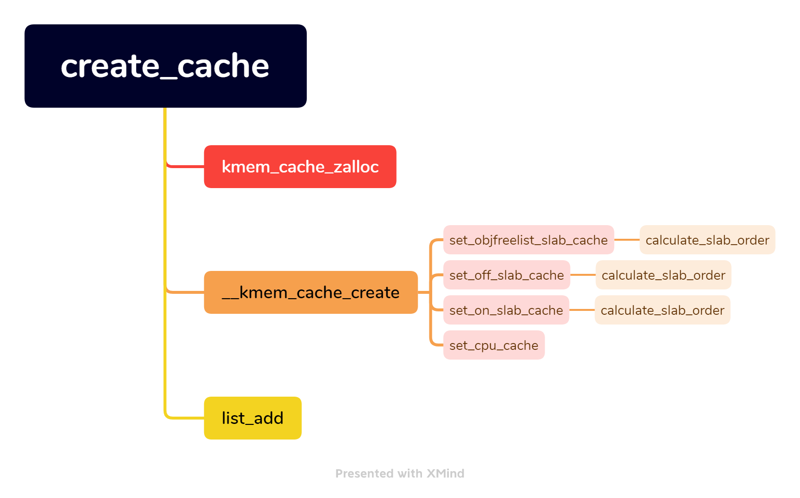

# Slab 分配器（linux-5.10.127）
Linux 使用伙伴系统（Buddy System）管理物理内存，每次只能分配 2^N 个地址连续的物理页面（x86 架构物理页大小一般为 4KB）。但是很多情况下，内核某个模块某个时候需要申请的内存是远远小于 4KB 的，或者跟 2^N 个页面的大小差别大，如果使用伙伴系统的话，必定是会产生很大的浪费。所以，一个粒度更小的分配器呼之欲出，Slab 就是为了解决这个小粒度内存分配的问题。

此外，我们考虑下面场景：如果一个内核模块经常使用某一种类型的对象，或者说频繁的创建、回收某一种类型的对象，那我们是不是可以尝试将这类对象单独存放起来，当模块不再使用时一个对象时，我们暂时先不释放对象的内存，而是缓存起来，等该模块再此申请使用这类对象，我们把之前应该回收的对象再拿出来，只不过重新构造一下对象，这样我们就减少了一次释放、申请内存的操作了。

Slab 分配器构建于伙伴系统之上的一个更加细粒度的内存分配系统。Slab 分配器每次从伙伴系统申请一块足够大的内存块，然后对这些内存空间实现了自己的算法进而对小块内存进行管理。SALB 分配器背后的基本思想是缓存常用对象，供内核使用。如果没有基于对象的分配器，内核将花费大量时间来分配，初始化和释放同一个对象。

## 设计哲学
### Overview
Slab 指的是一块 2^N 个地址连续物理页面组成的内存块，该内存块被切割成大小相等的 Obj。Slab 并没有专门的数据结构表示，Linux 在 page 数据结构中集成了 Slab 相关的成员。

Slab 分配器主要的数据结构有三个：kmem_cache、kmem_cache_node 和 array_cache，三者关系如下：


- cache 描述符：kmem_cache 结构体类型的对象，保存 cache 的基本信息，比如名字、对象大小、对齐，每个 Slab 需要申请多少个页面已经切分 Obj 的个数
- kmem_cache_node：管理 Slab
- array_cache：缓存 Obj

### PerCPU Cache
每次从 kem_cache 申请 Obj 或者将 Obj 归还给 kmen_cache 时，并不是直接操作 Slab，而是优先方法 kmem_cache::cpu_cache 缓存的 Obj；而且每个 CPU 都有专有的 cpu_cache。

调用 alloc_kmem_cache_cpus() 函数初始化 kmem_cache::cpu_cache 成员，参数 entries 表示 array_cache::entry 数组长度。
1. 首先调用 __alloc_percpu() 分配一个或者多个 array_cache
1. 遍历每个 array_cache，调用 init_arraycache() 做初始化

```
/// @file mm/slab.c
1731 static struct array_cache __percpu *alloc_kmem_cache_cpus(
1732                 struct kmem_cache *cachep, int entries, int batchcount)
1733 {
1734         int cpu;
1735         size_t size;
1736         struct array_cache __percpu *cpu_cache;
1737
1738         size = sizeof(void *) * entries + sizeof(struct array_cache);
1739         cpu_cache = __alloc_percpu(size, sizeof(void *));
1740
1741         if (!cpu_cache)
1742                 return NULL;
1743
1744         for_each_possible_cpu(cpu) {
1745                 init_arraycache(per_cpu_ptr(cpu_cache, cpu),
1746                                 entries, batchcount);
1747         }
1748
1749         return cpu_cache;
1750 }
```
init_arraycache() 给 array_cache 成员 avail、limit、batchcount 和 touched 赋值。
```
/// @file mm/slab.c
522 static void init_arraycache(struct array_cache *ac, int limit, int batch)
523 {
524         if (ac) {
525                 ac->avail = 0;
526                 ac->limit = limit;
527                 ac->batchcount = batch;
528                 ac->touched = 0;
529         }
530 }
```
申请 Obj 时，首先检查当前 cpu_cache 是否有可用 Obj，如果 avail 不为 0，表示有可用对象，直接从 entry 取一个 Obj 返回。
```
/// @file mm/slab.c
3029 static inline void *____cache_alloc(struct kmem_cache *cachep, gfp_t flags)
3030 {
3031         void *objp;
3032         struct array_cache *ac;
3033
3034         check_irq_off();
3035
3036         ac = cpu_cache_get(cachep);
3037         if (likely(ac->avail)) {
3038                 ac->touched = 1;
3039                 objp = ac->entry[--ac->avail];
3040
3041                 STATS_INC_ALLOCHIT(cachep);
3042                 goto out;
3043         }
...
```

归还 Obj 也是同样的道理，直接放入 cpu_cache 中。
```
/// @file mm/slab.c
591 /* &alien->lock must be held by alien callers. */
592 static __always_inline void __free_one(struct array_cache *ac, void *objp)
593 {
594         /* Avoid trivial double-free. */
595         if (IS_ENABLED(CONFIG_SLAB_FREELIST_HARDENED) &&
596             WARN_ON_ONCE(ac->avail > 0 && ac->entry[ac->avail - 1] == objp))
597                 return;
598         ac->entry[ac->avail++] = objp;
599 }
```

### Slab/page
page 数据结构比较复杂，Slab 基本使用如下成员。
```
/// @file include/linux/mm_types.h
 70 struct page {
 71         unsigned long flags;            /* Atomic flags, some possibly
 72                                          * updated asynchronously */
... 
105                 struct {        /* slab, slob and slub */
106                         union {
107                                 struct list_head slab_list;
...
118                         };
119                         struct kmem_cache *slab_cache; /* not slob */
120                         /* Double-word boundary */
121                         void *freelist;         /* first free object */
122                         union {
123                                 void *s_mem;    /* slab: first object */
...
130                         };
131                 }; 
...
228 } _struct_page_alignment;
```


freelist 也叫做 slabmgmt，有两种类型：OFF_SLAB 和 ON_SLAB。OFF_SLAB 表示 freelist 需要额外申请，而 ON_SLAB 表示利用 Slab 的空间存储。alloc_slabmgmt() 函数用于申请 freelist。
```
/// @file mm/slab.c
2291 static void *alloc_slabmgmt(struct kmem_cache *cachep,
2292                                    struct page *page, int colour_off,
2293                                    gfp_t local_flags, int nodeid)
2294 {
2295         void *freelist;
2296         void *addr = page_address(page);
2297
2298         page->s_mem = addr + colour_off;
2299         page->active = 0;
2300
2301         if (OBJFREELIST_SLAB(cachep))
2302                 freelist = NULL;
2303         else if (OFF_SLAB(cachep)) { /* 再申请一块内存用于 freelist */
2304                 /* Slab management obj is off-slab. */
2305                 freelist = kmem_cache_alloc_node(cachep->freelist_cache,
2306                                               local_flags, nodeid);
2307         } else { /* 利用 Slab 末尾空间存储 freelist */
2308                 /* We will use last bytes at the slab for freelist */
2309                 freelist = addr + (PAGE_SIZE << cachep->gfporder) -
2310                                 cachep->freelist_size;
2311         }
2312
2313         return freelist;
2314 }
```

freelist 实际上是一个数组，freelist[active, ) 记录了 Slab 中空闲 Obj 的索引号，cache_init_objs() 函数用于初始化 freelist，在初始化的时候，freelist[i] = i。
```
/// @file mm/slab.c
2481 static void cache_init_objs(struct kmem_cache *cachep,
2482                             struct page *page)
2483 {
2484         int i;
2485         void *objp;
2486         bool shuffled;
2487
2488         cache_init_objs_debug(cachep, page);
2489
2490         /* Try to randomize the freelist if enabled */
2491         shuffled = shuffle_freelist(cachep, page);
2492
2493         if (!shuffled && OBJFREELIST_SLAB(cachep)) {
2494                 page->freelist = index_to_obj(cachep, page, cachep->num - 1) +
2495                                                 obj_offset(cachep);
2496         }
2497
2498         for (i = 0; i < cachep->num; i++) {
2499                 objp = index_to_obj(cachep, page, i);
2500                 objp = kasan_init_slab_obj(cachep, objp);
2501
2502                 /* constructor could break poison info */
2503                 if (DEBUG == 0 && cachep->ctor) {
2504                         kasan_unpoison_object_data(cachep, objp);
2505                         cachep->ctor(objp); // 执行构造函数
2506                         kasan_poison_object_data(cachep, objp);
2507                 }
2508
2509                 if (!shuffled)
2510                         set_free_obj(page, i, i);
2511         }
2512 }
```

page->active 表示本 slab 分配出的对象，也表示 freelist 数组可用使用的是 [active, ...) 区间，该区间保存的索引是空闲 Obj 的索引。get_free_obj/set_free_obj() 两个函数是访问 freelist 的接口。
```
/// @file mm/slab.c
2316 static inline freelist_idx_t get_free_obj(struct page *page, unsigned int idx)
2317 {
2318         return ((freelist_idx_t *)page->freelist)[idx];
2319 }
2320
2321 static inline void set_free_obj(struct page *page,
2322                                         unsigned int idx, freelist_idx_t val)
2323 {
2324         ((freelist_idx_t *)(page->freelist))[idx] = val;
2325 }
```

当使用 get_free_obj() 函数获取一个空闲 Obj 的索引后，获取 Obj 地址就很简单了。index_to_obj() 函数可以看出，通过一个 index 获取一个 Obj 的方法。
```
/// @file mm/slab.c
374 static inline void *index_to_obj(struct kmem_cache *cache, struct page *page,
375                                  unsigned int idx)
376 {
377         return page->s_mem + cache->size * idx;
378 }
```

前面分析过，freelist 有两种存储位置。ON_SLAB 还需要区分：1）使用最后一个 Obj 存储 freelist；2）使用末尾空闲空间存储 freelist。
```
/// @file mm/slab.c
1816 static bool set_objfreelist_slab_cache(struct kmem_cache *cachep,
1817                         size_t size, slab_flags_t flags)
1818 {
1819         size_t left;
1820
1821         cachep->num = 0;
1822
...
1828         if (unlikely(slab_want_init_on_free(cachep)))
1829                 return false;
1830
1831         if (cachep->ctor || flags & SLAB_TYPESAFE_BY_RCU)
1832                 return false;
1833
1834         left = calculate_slab_order(cachep, size,
1835                         flags | CFLGS_OBJFREELIST_SLAB);
1836         if (!cachep->num)
1837                 return false;
1838         /* 一个空闲的 obj 能够放下 freelist */
1839         if (cachep->num * sizeof(freelist_idx_t) > cachep->object_size)
1840                 return false;
1841
1842         cachep->colour = left / cachep->colour_off;
1843
1844         return true;
1845 }
1846
1847 static bool set_off_slab_cache(struct kmem_cache *cachep,
1848                         size_t size, slab_flags_t flags)
1849 {
1850         size_t left;
1851
1852         cachep->num = 0;
1853
...
1858         if (flags & SLAB_NOLEAKTRACE)
1859                 return false;
1860
...
1865         left = calculate_slab_order(cachep, size, flags | CFLGS_OFF_SLAB);
1866         if (!cachep->num)
1867                 return false;
1868
...          /* 剩余空间足够，利用剩余空间 */
1873         if (left >= cachep->num * sizeof(freelist_idx_t))
1874                 return false;
1875
1876         cachep->colour = left / cachep->colour_off;
1877
1878         return true;
1879 }
1880
1881 static bool set_on_slab_cache(struct kmem_cache *cachep,
1882                         size_t size, slab_flags_t flags)
1883 {
1884         size_t left;
1885
1886         cachep->num = 0;
1887
1888         left = calculate_slab_order(cachep, size, flags);
1889         if (!cachep->num)
1890                 return false;
1891
1892         cachep->colour = left / cachep->colour_off;
1893
1894         return true;
1895 }
```

### transfer_objects
当 cpu_cache 没有缓存的 Obj，需要从其他地方转移一部分空闲 Obj 到 cpu_cache。首先调用 transfer_objects() 尝试从 shared 转移 Obj 到 cpu_cache。
```
/// @file mm/slab.c
574 static int transfer_objects(struct array_cache *to,
575                 struct array_cache *from, unsigned int max)
576 {
577         /* Figure out how many entries to transfer */
578         int nr = min3(from->avail, max, to->limit - to->avail);
579
580         if (!nr)
581                 return 0;
582
583         memcpy(to->entry + to->avail, from->entry + from->avail -nr,
584                         sizeof(void *) *nr);
585
586         from->avail -= nr;
587         to->avail += nr;
588         return nr;
589 }
```
如果 shared 上没有空闲的 Obj，调用 alloc_block() 尝试从 Slab 转移 batchcount 个 Obj 到 cpu_cache。
```
/// @file mm/slab.c
2877 static __always_inline int alloc_block(struct kmem_cache *cachep,
2878                 struct array_cache *ac, struct page *page, int batchcount)
2879 {
2880         /*
2881          * There must be at least one object available for
2882          * allocation.
2883          */
2884         BUG_ON(page->active >= cachep->num);
2885
2886         while (page->active < cachep->num && batchcount--) {
2887                 STATS_INC_ALLOCED(cachep);
2888                 STATS_INC_ACTIVE(cachep);
2889                 STATS_SET_HIGH(cachep);
2890
2891                 ac->entry[ac->avail++] = slab_get_obj(cachep, page);
2892         }
2893
2894         return batchcount;
2895 }
```

当然，如果 cpu_cache 上 Obj 过多，已经没有空间存储释放的 Obj，需要将 cpu_cahce 上的 Obj 转移到 shared 或者 Slab。free_block() 用于将 Obj 从 cpu_cache 转移到 Slab，逻辑是遍历 array_cache：1）将空闲的 Obj 转移到所属的 Slab 上；2）将 Slab 放入 free 或者 partial 链表上。最后如果空闲 Obj 过多，就将 free 链表上一部分 Slab 转移到目标 list，准备释放。
```
/// @file mm/slab.c
3321 static void free_block(struct kmem_cache *cachep, void **objpp,
3322                         int nr_objects, int node, struct list_head *list)
3323 {
3324         int i;
3325         struct kmem_cache_node *n = get_node(cachep, node);
3326         struct page *page;
3327         /* 递增空闲 Obj 数量 */
3328         n->free_objects += nr_objects;
3329         /* 遍历 array_cache，将其转移到对应的 Slab */
3330         for (i = 0; i < nr_objects; i++) {
3331                 void *objp;
3332                 struct page *page;
3333
3334                 objp = objpp[i];
3335
3336                 page = virt_to_head_page(objp);
3337                 list_del(&page->slab_list);
3338                 check_spinlock_acquired_node(cachep, node);
3339                 slab_put_obj(cachep, page, objp);
3340                 STATS_DEC_ACTIVE(cachep);
3341
3342                 /* fixup slab chains */
3343                 if (page->active == 0) {
3344                         list_add(&page->slab_list, &n->slabs_free);
3345                         n->free_slabs++;
3346                 } else {
3347                         /* Unconditionally move a slab to the end of the
3348                          * partial list on free - maximum time for the
3349                          * other objects to be freed, too.
3350                          */
3351                         list_add_tail(&page->slab_list, &n->slabs_partial);
3352                 }
3353         }
3354         /* 空闲 Obj 过多，释放一部分 Slab */
3355         while (n->free_objects > n->free_limit && !list_empty(&n->slabs_free)) {
3356                 n->free_objects -= cachep->num;
3357
3358                 page = list_last_entry(&n->slabs_free, struct page, slab_list);
3359                 list_move(&page->slab_list, list);
3360                 n->free_slabs--;
3361                 n->total_slabs--;
3362         }
3363 }
```

### calculate_slab_order
Slab 分配器每次向伙伴系统申请 2^N 个页面，calculate_slab_order() 函数就是计算 N 的大小。calculate_slab_order 处理逻辑：gfporder 从 0 开始，调用 cache_estimate 计算 2^gfporder 个页面可以切割的 Obj 数量 num 和剩余的内存大小 left_over。

如果是 OFF_SLAB，则需要找到一个可申请 freelist 的 kmem_cache，不存在的话需要递增 gfporder，并且目标 kmem_cache 不能再是 OFF_SLAB。
```
1663 static size_t calculate_slab_order(struct kmem_cache *cachep,
1664                                 size_t size, slab_flags_t flags)
1665 {
1666         size_t left_over = 0;
1667         int gfporder;
1668         /* 从 2^gfporder 页面开始尝试 */
1669         for (gfporder = 0; gfporder <= KMALLOC_MAX_ORDER; gfporder++) {
1670                 unsigned int num;
1671                 size_t remainder;
1672                 /* 评估可以切分的 obj 数量 */
1673                 num = cache_estimate(gfporder, size, flags, &remainder);
1674                 if (!num)
1675                         continue;
1676
1677                 /* Can't handle number of objects more than SLAB_OBJ_MAX_NUM */
1678                 if (num > SLAB_OBJ_MAX_NUM)
1679                         break;
1680
1681                 if (flags & CFLGS_OFF_SLAB) {
1682                         struct kmem_cache *freelist_cache;
1683                         size_t freelist_size;
1684
1685                         freelist_size = num * sizeof(freelist_idx_t);
1686                         freelist_cache = kmalloc_slab(freelist_size, 0u);
1687                         if (!freelist_cache) /* 不存在，递增 gfporder */
1688                                 continue;
...
1694                         if (OFF_SLAB(freelist_cache))
1695                                 continue;
1696
1697                         /* check if off slab has enough benefit */
1698                         if (freelist_cache->size > cachep->size / 2)
1699                                 continue;
1700                 }
1701
1702                 /* Found something acceptable - save it away */
1703                 cachep->num = num;
1704                 cachep->gfporder = gfporder;
1705                 left_over = remainder;
1706
1707                 /*
1708                  * A VFS-reclaimable slab tends to have most allocations
1709                  * as GFP_NOFS and we really don't want to have to be allocating
1710                  * higher-order pages when we are unable to shrink dcache.
1711                  */
1712                 if (flags & SLAB_RECLAIM_ACCOUNT)
1713                         break;
1714
1715                 /*
1716                  * Large number of objects is good, but very large slabs are
1717                  * currently bad for the gfp()s.
1718                  */
1719                 if (gfporder >= slab_max_order)
1720                         break;
1721
1722                 /*
1723                  * Acceptable internal fragmentation?
1724                  */
1725                 if (left_over * 8 <= (PAGE_SIZE << gfporder))
1726                         break;
1727         }
1728         return left_over;
1729 }
```
在函数 cache_estimate 函数中，我们可以看到 freelist 这三种布局方式，计算 obj 的数量的差别。
```
400 static unsigned int cache_estimate(unsigned long gfporder, size_t buffer_size,
401                 slab_flags_t flags, size_t *left_over)
402 {
403         unsigned int num;
404         size_t slab_size = PAGE_SIZE << gfporder; /* 预估使用的页面大小 */
...
423         if (flags & (CFLGS_OBJFREELIST_SLAB | CFLGS_OFF_SLAB)) {
424                 num = slab_size / buffer_size;
425                 *left_over = slab_size % buffer_size;
426         } else { /* 每个 obj 都需要额外一个 freelist_idx_t */
427                 num = slab_size / (buffer_size + sizeof(freelist_idx_t));
428                 *left_over = slab_size %
429                         (buffer_size + sizeof(freelist_idx_t));
430         }
431
432         return num;
433 }
```

### PerNode Slab
NUMA 结构下, 每个处理器 CPU 与一个本地内存直接相连, 而不同处理器之前则通过总线进行进一步的连接, 因此相对于任何一个 CPU 访问本地内存的速度比访问远程内存的速度要快。Linux 把物理内存按照 CPU 节点划分为不同的 node, 每个node作为某个 CPU 结点的本地内存, 而作为其他CPU节点的远程内存。

Slab 为每个内存 node 都分配一个 kmem_cache_node 数据结构。setup_kmem_cache_nodes() 函数用于初始化 kmem_cache::node 成员，调用关系如下：


setup_kmem_cache_nodes() 函数遍历每个 node，然后对每个 node 调用 setup_kmem_cache_node() 函数进行初始化。
```
/// @file mm/slab.c
3765 static int setup_kmem_cache_nodes(struct kmem_cache *cachep, gfp_t gfp)
3766 {
3767         int ret;
3768         int node;
3769         struct kmem_cache_node *n;
3770
3771         for_each_online_node(node) {
3772                 ret = setup_kmem_cache_node(cachep, node, gfp, true);
3773                 if (ret)
3774                         goto fail;
3775
3776         }
3777
3778         return 0;
3779
3780 fail:
...
3795         return -ENOMEM;
3796 }
```
setup_kmem_cache_node() 函数就是初始化 kmem_cache_node 各数据成员。
```
/// @file mm/slab.c
882 static int setup_kmem_cache_node(struct kmem_cache *cachep,
883                                 int node, gfp_t gfp, bool force_change)
884 {
885         int ret = -ENOMEM;
886         struct kmem_cache_node *n;
887         struct array_cache *old_shared = NULL;
888         struct array_cache *new_shared = NULL;
889         struct alien_cache **new_alien = NULL;
890         LIST_HEAD(list);
891
892         if (use_alien_caches) {
893                 new_alien = alloc_alien_cache(node, cachep->limit, gfp);
894                 if (!new_alien)
895                         goto fail;
896         }
897
898         if (cachep->shared) {
899                 new_shared = alloc_arraycache(node,
900                         cachep->shared * cachep->batchcount, 0xbaadf00d, gfp);
901                 if (!new_shared)
902                         goto fail;
903         }
904         // 初始化 kmem_cache::node 成员
905         ret = init_cache_node(cachep, node, gfp);
906         if (ret)
907                 goto fail;
908
909         n = get_node(cachep, node);
910         spin_lock_irq(&n->list_lock);
911         if (n->shared && force_change) {
912                 free_block(cachep, n->shared->entry,
913                                 n->shared->avail, node, &list);
914                 n->shared->avail = 0;
915         }
916
917         if (!n->shared || force_change) {
918                 old_shared = n->shared;
919                 n->shared = new_shared;
920                 new_shared = NULL;
921         }
922
923         if (!n->alien) {
924                 n->alien = new_alien;
925                 new_alien = NULL;
926         }
927
928         spin_unlock_irq(&n->list_lock);
929         slabs_destroy(cachep, &list);
930
931         /*
932          * To protect lockless access to n->shared during irq disabled context.
933          * If n->shared isn't NULL in irq disabled context, accessing to it is
934          * guaranteed to be valid until irq is re-enabled, because it will be
935          * freed after synchronize_rcu().
936          */
937         if (old_shared && force_change)
938                 synchronize_rcu();
939
940 fail:
941         kfree(old_shared);
942         kfree(new_shared);
943         free_alien_cache(new_alien);
944
945         return ret;
946 }
```
init_cache_node() 函数逻辑如下：1）调用 kmalloc_node() 函数申请一个 kmem_cache_node 对象；2）调用 kmem_cache_node_init() 函数对其进行初始化；3）将其赋值给 cachep->node[node]。
```
/// @file mm/slab.c
817 static int init_cache_node(struct kmem_cache *cachep, int node, gfp_t gfp)
818 {
819         struct kmem_cache_node *n;
820
821         /*
822          * Set up the kmem_cache_node for cpu before we can
823          * begin anything. Make sure some other cpu on this
824          * node has not already allocated this
825          */
826         n = get_node(cachep, node);
827         if (n) {
828                 spin_lock_irq(&n->list_lock);
829                 n->free_limit = (1 + nr_cpus_node(node)) * cachep->batchcount +
830                                 cachep->num;
831                 spin_unlock_irq(&n->list_lock);
832
833                 return 0;
834         }
835
836         n = kmalloc_node(sizeof(struct kmem_cache_node), gfp, node);
837         if (!n)
838                 return -ENOMEM;
839
840         kmem_cache_node_init(n);
841         n->next_reap = jiffies + REAPTIMEOUT_NODE +
842                     ((unsigned long)cachep) % REAPTIMEOUT_NODE;
843
844         n->free_limit =
845                 (1 + nr_cpus_node(node)) * cachep->batchcount + cachep->num;
846
847         /*
848          * The kmem_cache_nodes don't come and go as CPUs
849          * come and go.  slab_mutex is sufficient
850          * protection here.
851          */
852         cachep->node[node] = n;
853
854         return 0;
855 }
```
kmem_cache_node_init() 函数对 kmem_cache_node 对象做初始化。
```
/// @file mm/slab.c
226 static void kmem_cache_node_init(struct kmem_cache_node *parent)
227 {
228         INIT_LIST_HEAD(&parent->slabs_full);
229         INIT_LIST_HEAD(&parent->slabs_partial);
230         INIT_LIST_HEAD(&parent->slabs_free);
231         parent->total_slabs = 0;
232         parent->free_slabs = 0;
233         parent->shared = NULL;
234         parent->alien = NULL;
235         parent->colour_next = 0;
236         spin_lock_init(&parent->list_lock);
237         parent->free_objects = 0;
238         parent->free_touched = 0;
239 }
```
get_first_slab() 函数用从 kmem_cache_node 中返回一个 Slab。
```
/// @file mm/slab.c
2824 static struct page *get_first_slab(struct kmem_cache_node *n, bool pfmemalloc)
2825 {
2826         struct page *page;
2827
2828         assert_spin_locked(&n->list_lock);
2829         page = list_first_entry_or_null(&n->slabs_partial, struct page,
2830                                         slab_list);
2831         if (!page) {
2832                 n->free_touched = 1;
2833                 page = list_first_entry_or_null(&n->slabs_free, struct page,
2834                                                 slab_list);
2835                 if (page)
2836                         n->free_slabs--;
2837         }
2838
2839         if (sk_memalloc_socks())
2840                 page = get_valid_first_slab(n, page, pfmemalloc);
2841
2842         return page;
2843 }
```

## kmem_cache_create
kmen_cache_create() 函数用于创建一个 cache，主要是初始化 kmem_cache、kmem_cache_node 和 array_cache 三个数据结构。调用流程如下：


kmem_cache_create() 函数直接调用 kmem_cache_create_usercopy() 函数。
```
/// @file mm/slab_common.c
404 struct kmem_cache *
405 kmem_cache_create(const char *name, unsigned int size, unsigned int align,
406                 slab_flags_t flags, void (*ctor)(void *))
407 {
408         return kmem_cache_create_usercopy(name, size, align, flags, 0, 0,
409                                           ctor);
410 }
```
参数含义如下：
- name：cache 名字
- size：对象大小
- align：对象对齐
- flags：Slab 标志
  - SLAB_POISON：引用未初始化内存检查
  - SLAB_RED_ZONE：内存溢出检查
  - SLAB_HWCACHE_ALIGN：硬件 cacheline 对齐
- ctor：对象构造函数

### kmem_cache_create_usercopy
kmem_cache_create_usercopy() 函数比 kmem_cache_create() 函数多了两个参数：useroffset 和 usersize，其含义如下：
- useroffset：Usercopy region offset
- usersize：Usercopy region size

调用 __kmem_cache_alias() 函数尝试使用已有 cahce，如果找到，就返回。否则调用 create_cache() 创建一个 cache。
```
/// @file mm/slab_common.c
299 struct kmem_cache *
300 kmem_cache_create_usercopy(const char *name,
301                   unsigned int size, unsigned int align,
302                   slab_flags_t flags,
303                   unsigned int useroffset, unsigned int usersize,
304                   void (*ctor)(void *))
305 {
306         struct kmem_cache *s = NULL;
307         const char *cache_name;
308         int err;
309
310         get_online_cpus();
311         get_online_mems();
312
313         mutex_lock(&slab_mutex);
... name/size/flags 参数检查
332         flags &= CACHE_CREATE_MASK;
333
334         /* Fail closed on bad usersize of useroffset values. */
335         if (WARN_ON(!usersize && useroffset) ||
336             WARN_ON(size < usersize || size - usersize < useroffset))
337                 usersize = useroffset = 0;
338
339         if (!usersize) /* 尝试复用已有 cache */
340                 s = __kmem_cache_alias(name, size, align, flags, ctor);
341         if (s)
342                 goto out_unlock;
343         /* 将 name 从用户空间拷贝到 kernel */
344         cache_name = kstrdup_const(name, GFP_KERNEL);
345         if (!cache_name) {
346                 err = -ENOMEM;
347                 goto out_unlock;
348         }
349
350         s = create_cache(cache_name, size,
351                          calculate_alignment(flags, align, size),
352                          flags, useroffset, usersize, ctor, NULL);
353         if (IS_ERR(s)) {
...
356         }
357
358 out_unlock:
359         mutex_unlock(&slab_mutex);
360
361         put_online_mems();
362         put_online_cpus();
363
364         if (err) {
...
374         }
375         return s;
376 }
```
__kmem_cache_alias() 调用 find_mergeable() 获取一个可以复用的 cache，然后递增引用计数，调整 object_size。
```
/// @file mm/slab.c
1797 struct kmem_cache *
1798 __kmem_cache_alias(const char *name, unsigned int size, unsigned int align,
1799                    slab_flags_t flags, void (*ctor)(void *))
1800 {
1801         struct kmem_cache *cachep;
1802
1803         cachep = find_mergeable(size, align, flags, name, ctor);
1804         if (cachep) {
1805                 cachep->refcount++;
1806
1807                 /*
1808                  * Adjust the object sizes so that we clear
1809                  * the complete object on kzalloc.
1810                  */
1811                 cachep->object_size = max_t(int, cachep->object_size, size);
1812         }
1813         return cachep;
1814 }
```
find_mergeable() 根据 size 和 align 选择一个兼容的 cache -- s。
- flags 都有标志位 SLAB_MERGE_SAME，且没有 SLAB_NEVER_MERGE
- s->size 大于 size 且 s->size - size <= sizeof(void*)
- align 匹配

```
/// @file mm/slab_common.c
184 struct kmem_cache *find_mergeable(unsigned int size, unsigned int align,
185                 slab_flags_t flags, const char *name, void (*ctor)(void *))
186 {
187         struct kmem_cache *s;
188         /* 配置了不允许复用 */
189         if (slab_nomerge)
190                 return NULL;
191         /* 指定了构造函数，无法复用 */
192         if (ctor)
193                 return NULL;
194
195         size = ALIGN(size, sizeof(void *));
196         align = calculate_alignment(flags, align, size);
197         size = ALIGN(size, align);
198         flags = kmem_cache_flags(size, flags, name);
199         /* flags 使能了不复用 */
200         if (flags & SLAB_NEVER_MERGE)
201                 return NULL;
202         /* 遍历全局 slab_caches */
203         list_for_each_entry_reverse(s, &slab_caches, list) {
204                 if (slab_unmergeable(s)) // 该 cache 不允许复用
205                         continue;
206                 /* s->size 过小 */
207                 if (size > s->size)
208                         continue;
209                 /* flags 不匹配 */
210                 if ((flags & SLAB_MERGE_SAME) != (s->flags & SLAB_MERGE_SAME))
211                         continue;
                    /* align 不兼容 */
216                 if ((s->size & ~(align - 1)) != s->size)
217                         continue;
218                 /* s->size 过大 */
219                 if (s->size - size >= sizeof(void *))
220                         continue;
221                 /* align 不兼容 */
222                 if (IS_ENABLED(CONFIG_SLAB) && align &&
223                         (align > s->align || s->align % align))
224                         continue;
225
226                 return s;
227         }
228         return NULL;
229 }
```
### create_cache
1. 调用 kmem_cache_zalloc() 创建一个 kmem_cache 对象（内容清零）
2. 赋值 name/size/align/ctor/useroffset/usersize
3. 调用 __kmem_cache_create() 进一步初始化 kmem_cache 对象
4. 将创建的 kmem_cache 加入到全局 slab_caches 链表



```
/// @file mm/slab_common.c
231 static struct kmem_cache *create_cache(const char *name,
232                 unsigned int object_size, unsigned int align,
233                 slab_flags_t flags, unsigned int useroffset,
234                 unsigned int usersize, void (*ctor)(void *),
235                 struct kmem_cache *root_cache)
236 {
237         struct kmem_cache *s;
238         int err;
239
240         if (WARN_ON(useroffset + usersize > object_size))
241                 useroffset = usersize = 0;
242
243         err = -ENOMEM; /* line#244 创建一个 kmem_cace 对象*/
244         s = kmem_cache_zalloc(kmem_cache, GFP_KERNEL);
245         if (!s)
246                 goto out;
247         /* 简单用户参数 */
248         s->name = name;
249         s->size = s->object_size = object_size;
250         s->align = align;
251         s->ctor = ctor;
252         s->useroffset = useroffset;
253         s->usersize = usersize;
254         /* 深入初始化 */
255         err = __kmem_cache_create(s, flags);
256         if (err)
257                 goto out_free_cache;
258         /* 初始化引用计数为 1，然后加入 slab_caches 链表 */
259         s->refcount = 1;
260         list_add(&s->list, &slab_caches);
261 out:
262         if (err)
263                 return ERR_PTR(err);
264         return s;
265
266 out_free_cache:
267         kmem_cache_free(kmem_cache, s);
268         goto out;
269 }
```
__kmem_cache_create() 函数逻辑如下：
1. 对 size 做对齐处理；
1. 调用 set_objfreelist_slab_cache/set_off_slab_cache/set_on_slab_cache 计算需要申请的页面个数，以及可以切分的对象个数；
1. 调用 setup_cpu_cache 进一步初始化；

```
/// @file mm/slab_common.c
1920 int __kmem_cache_create(struct kmem_cache *cachep, slab_flags_t flags)
1921 {
1922         size_t ralign = BYTES_PER_WORD;
1923         gfp_t gfp;
1924         int err;
1925         unsigned int size = cachep->size;
1926
1927 #if DEBUG
...
1941 #endif
             /* size 对齐 sizeof(void*) */
1948         size = ALIGN(size, BYTES_PER_WORD);
1949
1950         if (flags & SLAB_RED_ZONE) {
1951                 ralign = REDZONE_ALIGN;
1952                 /* If redzoning, ensure that the second redzone is suitably
1953                  * aligned, by adjusting the object size accordingly. */
1954                 size = ALIGN(size, REDZONE_ALIGN);
1955         }
1956
1957         /* 3) caller mandated alignment */
1958         if (ralign < cachep->align) {
1959                 ralign = cachep->align;
1960         }
1961         /* disable debug if necessary */
1962         if (ralign > __alignof__(unsigned long long))
1963                 flags &= ~(SLAB_RED_ZONE | SLAB_STORE_USER);
1964         /*
1965          * 4) Store it.
1966          */
1967         cachep->align = ralign;
1968         cachep->colour_off = cache_line_size();
1969         /* Offset must be a multiple of the alignment. */
1970         if (cachep->colour_off < cachep->align)
1971                 cachep->colour_off = cachep->align;
1972
1973         if (slab_is_available())
1974                 gfp = GFP_KERNEL;
1975         else
1976                 gfp = GFP_NOWAIT;
1977
1978 #if DEBUG
...
1999 #endif
2000
2001         kasan_cache_create(cachep, &size, &flags);
2002
2003         size = ALIGN(size, cachep->align);
2004         /*
2005          * We should restrict the number of objects in a slab to implement
2006          * byte sized index. Refer comment on SLAB_OBJ_MIN_SIZE definition.
2007          */
2008         if (FREELIST_BYTE_INDEX && size < SLAB_OBJ_MIN_SIZE)
2009                 size = ALIGN(SLAB_OBJ_MIN_SIZE, cachep->align);
2010
2011 #if DEBUG
...
2032 #endif
2033
2034         if (set_objfreelist_slab_cache(cachep, size, flags)) {
2035                 flags |= CFLGS_OBJFREELIST_SLAB;
2036                 goto done;
2037         }
2038
2039         if (set_off_slab_cache(cachep, size, flags)) {
2040                 flags |= CFLGS_OFF_SLAB;
2041                 goto done;
2042         }
2043
2044         if (set_on_slab_cache(cachep, size, flags))
2045                 goto done;
2046
2047         return -E2BIG;
2048
2049 done:
2050         cachep->freelist_size = cachep->num * sizeof(freelist_idx_t);
2051         cachep->flags = flags;
2052         cachep->allocflags = __GFP_COMP;
2053         if (flags & SLAB_CACHE_DMA)
2054                 cachep->allocflags |= GFP_DMA;
2055         if (flags & SLAB_CACHE_DMA32)
2056                 cachep->allocflags |= GFP_DMA32;
2057         if (flags & SLAB_RECLAIM_ACCOUNT)
2058                 cachep->allocflags |= __GFP_RECLAIMABLE;
2059         cachep->size = size;
2060         cachep->reciprocal_buffer_size = reciprocal_value(size);
2061
2062 #if DEBUG
...
2072 #endif
2073         /* freelist 放置外部，调用 kmalloc_slab 申请内存 */
2074         if (OFF_SLAB(cachep)) {
2075                 cachep->freelist_cache =
2076                         kmalloc_slab(cachep->freelist_size, 0u);
2077         }
2078
2079         err = setup_cpu_cache(cachep, gfp);
2080         if (err) {
...
2083         }
2084
2085         return 0;
2086 }
```

### setup_cpu_cache


当 slab 初始化完成后，slab_state >= FULL 条件成立，直接调用enable_cpucache 函数处理。
```
1752 static int __ref setup_cpu_cache(struct kmem_cache *cachep, gfp_t gfp)
1753 {
1754         if (slab_state >= FULL)
1755                 return enable_cpucache(cachep, gfp);
...
1789 }
```
enable_cpucache() 计算 limit 和 batchcount，然后调用 do_tune_cpucache 函数。
```
3846 static int enable_cpucache(struct kmem_cache *cachep, gfp_t gfp)
3847 {
3848         int err;
3849         int limit = 0;
3850         int shared = 0;
3851         int batchcount = 0;
3852
3853         err = cache_random_seq_create(cachep, cachep->num, gfp);
3854         if (err)
3855                 goto end;
3856
3857         if (limit && shared && batchcount) /* ?? */
3858                 goto skip_setup;
...          /* 设置缓存对象上限 */
3868         if (cachep->size > 131072)
3869                 limit = 1;
3870         else if (cachep->size > PAGE_SIZE)
3871                 limit = 8;
3872         else if (cachep->size > 1024)
3873                 limit = 24;
3874         else if (cachep->size > 256)
3875                 limit = 54;
3876         else
3877                 limit = 120;
3878
...
3888         shared = 0;
3889         if (cachep->size <= PAGE_SIZE && num_possible_cpus() > 1)
3890                 shared = 8;
3891
3892 #if DEBUG
...
3899 #endif
3900         batchcount = (limit + 1) / 2; /* 一次转移的对象数量 */
3901 skip_setup:
3902         err = do_tune_cpucache(cachep, limit, batchcount, shared, gfp);
3903 end:
3904         if (err)
3905                 pr_err("enable_cpucache failed for %s, error %d\n",
3906                        cachep->name, -err);
3907         return err;
3908 }
```
do_tune_cpucache() 主要做两件事情：
1. 调用 alloc_kmem_cache_cpus() 初始化 kmem_cache::cpu_cache 成员；
1. 调用 setup_kmem_cache_nodes() 初始化 kmem_cache::node 成员；

```
/// @file mm/slab.c
3799 static int do_tune_cpucache(struct kmem_cache *cachep, int limit,
3800                             int batchcount, int shared, gfp_t gfp)
3801 {
3802         struct array_cache __percpu *cpu_cache, *prev;
3803         int cpu;
3804         /* 初始化 kmem_cache::cpu_cache 成员 */
3805         cpu_cache = alloc_kmem_cache_cpus(cachep, limit, batchcount);
3806         if (!cpu_cache)
3807                 return -ENOMEM;
3808
3809         prev = cachep->cpu_cache;
3810         cachep->cpu_cache = cpu_cache;
3811         /*
3812          * Without a previous cpu_cache there's no need to synchronize remote
3813          * cpus, so skip the IPIs.
3814          */
3815         if (prev)
3816                 kick_all_cpus_sync();
3817
3818         check_irq_on();
3819         cachep->batchcount = batchcount;
3820         cachep->limit = limit;
3821         cachep->shared = shared;
3822
3823         if (!prev)
3824                 goto setup_node;
3825         /* 清理 prev */
3826         for_each_online_cpu(cpu) {
3827                 LIST_HEAD(list);
3828                 int node;
3829                 struct kmem_cache_node *n;
3830                 struct array_cache *ac = per_cpu_ptr(prev, cpu);
3831
3832                 node = cpu_to_mem(cpu);
3833                 n = get_node(cachep, node);
3834                 spin_lock_irq(&n->list_lock);
3835                 free_block(cachep, ac->entry, ac->avail, node, &list);
3836                 spin_unlock_irq(&n->list_lock);
3837                 slabs_destroy(cachep, &list);
3838         }
3839         free_percpu(prev);
3840
3841 setup_node: /* 初始化 kmem_cache::node 成员 */
3842         return setup_kmem_cache_nodes(cachep, gfp);
3843 }
```

## kmem_cache_alloc


kmem_cache_alloc() 函数用于从 cache 申请一个 Obj，其直接调用 slab_alloc 分配一个 Obj。
```
/// @file mm/slab.c
3481 void *kmem_cache_alloc(struct kmem_cache *cachep, gfp_t flags)
3482 {
3483         void *ret = slab_alloc(cachep, flags, _RET_IP_);
3484
3485         trace_kmem_cache_alloc(_RET_IP_, ret,
3486                                cachep->object_size, cachep->size, flags);
3487
3488         return ret;
3489 }
```
### slab_alloc
slab_alloc() ==> __do_cache_alloc() ==> ____cache_alloc() 
```
/// @file mm/slab.c
3283 static __always_inline void *
3284 __do_cache_alloc(struct kmem_cache *cachep, gfp_t flags)
3285 {
3286         return ____cache_alloc(cachep, flags);
3287 }

3291 static __always_inline void *
3292 slab_alloc(struct kmem_cache *cachep, gfp_t flags, unsigned long caller)
3293 {
3294         unsigned long save_flags;
3295         void *objp;
3296         struct obj_cgroup *objcg = NULL;
3297
3298         flags &= gfp_allowed_mask;
3299         cachep = slab_pre_alloc_hook(cachep, &objcg, 1, flags);
3300         if (unlikely(!cachep))
3301                 return NULL;
3302
3303         cache_alloc_debugcheck_before(cachep, flags);
3304         local_irq_save(save_flags);
3305         objp = __do_cache_alloc(cachep, flags);
3306         local_irq_restore(save_flags);
3307         objp = cache_alloc_debugcheck_after(cachep, flags, objp, caller);
3308         prefetchw(objp);
3309
3310         if (unlikely(slab_want_init_on_alloc(flags, cachep)) && objp)
3311                 memset(objp, 0, cachep->object_size);
3312
3313         slab_post_alloc_hook(cachep, objcg, flags, 1, &objp);
3314         return objp;
3315 }
```

### ____cache_alloc
____cache_alloc 是 Slab 分配 Obj 的核心函数。
1. 首先访问 array_cache，查看是否有空闲 Obj，如果存在的就返回，否则；
1. 调用 cache_alloc_refill 从 kmem_cache_node 转移一部分空闲 Obj 到 array_cahce
1. 再次返回 array_cache 分配 Obj

```
/// @file mm/slab.c
3029 static inline void *____cache_alloc(struct kmem_cache *cachep, gfp_t flags)
3030 {
3031         void *objp;
3032         struct array_cache *ac;
3033
3034         check_irq_off();
3035
3036         ac = cpu_cache_get(cachep);
3037         if (likely(ac->avail)) {
3038                 ac->touched = 1;
3039                 objp = ac->entry[--ac->avail];
3040
3041                 STATS_INC_ALLOCHIT(cachep);
3042                 goto out;
3043         }
3044
3045         STATS_INC_ALLOCMISS(cachep);
3046         objp = cache_alloc_refill(cachep, flags);
3047         /*
3048          * the 'ac' may be updated by cache_alloc_refill(),
3049          * and kmemleak_erase() requires its correct value.
3050          */
3051         ac = cpu_cache_get(cachep);
3052
3053 out:
3054         /*
3055          * To avoid a false negative, if an object that is in one of the
3056          * per-CPU caches is leaked, we need to make sure kmemleak doesn't
3057          * treat the array pointers as a reference to the object.
3058          */
3059         if (objp)
3060                 kmemleak_erase(&ac->entry[ac->avail]);
3061         return objp;
3062 }
```

### cache_alloc_refill
cache_alloc_refill() 函数用于从 Slab 转移 batchount 个空闲 Obj 到 array_cache。如果没有 Slab 有空闲内存，就需要再申请一个 Slab 用于内存分配。
```
/// @file mm/slab.c
2897 static void *cache_alloc_refill(struct kmem_cache *cachep, gfp_t flags)
2898 {
2899         int batchcount;
2900         struct kmem_cache_node *n;
2901         struct array_cache *ac, *shared;
2902         int node;
2903         void *list = NULL;
2904         struct page *page;
2905
2906         check_irq_off();
2907         node = numa_mem_id();
2908
2909         ac = cpu_cache_get(cachep);
2910         batchcount = ac->batchcount; /* 一次转移 Obj 的数量 */
2911         if (!ac->touched && batchcount > BATCHREFILL_LIMIT) {
2912                 /*
2913                  * If there was little recent activity on this cache, then
2914                  * perform only a partial refill.  Otherwise we could generate
2915                  * refill bouncing.
2916                  */
2917                 batchcount = BATCHREFILL_LIMIT;
2918         }
2919         n = get_node(cachep, node); /* 获取 kmem_cache_node */
2920
2921         BUG_ON(ac->avail > 0 || !n);
2922         shared = READ_ONCE(n->shared);
2923         if (!n->free_objects && (!shared || !shared->avail))
2924                 goto direct_grow; /* 没有空余 Obj，再申请一个 Slab */
2925
2926         spin_lock(&n->list_lock);
2927         shared = READ_ONCE(n->shared);
2928
2929         /* 先尝试从 shared 中转移 Obj 到 ac */
2930         if (shared && transfer_objects(ac, shared, batchcount)) {
2931                 shared->touched = 1;
2932                 goto alloc_done; /* 转移完成 */
2933         }
2934
2935         while (batchcount > 0) {
2936                 /* Get slab alloc is to come from. */
2937                 page = get_first_slab(n, false); /* 找到一个 Slab */
2938                 if (!page) /* 没有可用的 Slab，需要再申请一个 Slab */
2939                         goto must_grow;
2940
2941                 check_spinlock_acquired(cachep);
2942                 /* 转移 Obj 到 ac */
2943                 batchcount = alloc_block(cachep, ac, page, batchcount);
2944                 fixup_slab_list(cachep, n, page, &list);
2945         }
2946
2947 must_grow:
2948         n->free_objects -= ac->avail;
2949 alloc_done:
2950         spin_unlock(&n->list_lock);
2951         fixup_objfreelist_debug(cachep, &list);
2952
2953 direct_grow:
2954         if (unlikely(!ac->avail)) {
2955                 /* Check if we can use obj in pfmemalloc slab */
2956                 if (sk_memalloc_socks()) {
2957                         void *obj = cache_alloc_pfmemalloc(cachep, n, flags);
2958
2959                         if (obj)
2960                                 return obj;
2961                 }
2962                 /* 再申请一个 Slab */
2963                 page = cache_grow_begin(cachep, gfp_exact_node(flags), node);
2964
2965                 /*
2966                  * cache_grow_begin() can reenable interrupts,
2967                  * then ac could change.
2968                  */
2969                 ac = cpu_cache_get(cachep);
2970                 if (!ac->avail && page)
2971                         alloc_block(cachep, ac, page, batchcount);
2972                 cache_grow_end(cachep, page);
2973
2974                 if (!ac->avail)
2975                         return NULL;
2976         }
2977         ac->touched = 1;
2978
2979         return ac->entry[--ac->avail];
2980 }
```

### cache_grow_begin/cache_grow_end
cache_grow_begin() 的核心是：
1. 调用 kmem_getpages() 函数申请 2^ gfporder 个地址连续的页面；
1. 调用 cache_init_objs() 函数初始化 freelist

```
/// @file mm/slab.c
2563 static struct page *cache_grow_begin(struct kmem_cache *cachep,
2564                                 gfp_t flags, int nodeid)
2565 {
2566         void *freelist;
2567         size_t offset;
2568         gfp_t local_flags;
2569         int page_node;
2570         struct kmem_cache_node *n;
2571         struct page *page;
2572
2573         /*
2574          * Be lazy and only check for valid flags here,  keeping it out of the
2575          * critical path in kmem_cache_alloc().
2576          */
2577         if (unlikely(flags & GFP_SLAB_BUG_MASK))
2578                 flags = kmalloc_fix_flags(flags);
2579
2580         WARN_ON_ONCE(cachep->ctor && (flags & __GFP_ZERO));
2581         local_flags = flags & (GFP_CONSTRAINT_MASK|GFP_RECLAIM_MASK);
2582
2583         check_irq_off();
2584         if (gfpflags_allow_blocking(local_flags))
2585                 local_irq_enable();
2586
...          /* 申请 2^ gfporder 个地址连续的物理内存 */
2591         page = kmem_getpages(cachep, local_flags, nodeid);
2592         if (!page)
2593                 goto failed;
2594
2595         page_node = page_to_nid(page);
2596         n = get_node(cachep, page_node);
2597
2598         /* Get colour for the slab, and cal the next value. */
2599         n->colour_next++;
2600         if (n->colour_next >= cachep->colour)
2601                 n->colour_next = 0;
2602
2603         offset = n->colour_next;
2604         if (offset >= cachep->colour)
2605                 offset = 0;
2606
2607         offset *= cachep->colour_off;
2608
2609         /*
2610          * Call kasan_poison_slab() before calling alloc_slabmgmt(), so
2611          * page_address() in the latter returns a non-tagged pointer,
2612          * as it should be for slab pages.
2613          */
2614         kasan_poison_slab(page);
2615
2616         /* 分配 freelist */
2617         freelist = alloc_slabmgmt(cachep, page, offset,
2618                         local_flags & ~GFP_CONSTRAINT_MASK, page_node);
2619         if (OFF_SLAB(cachep) && !freelist)
2620                 goto opps1;
2621         /* page->slab_cache = cahce; page->freelist = freelist */
2622         slab_map_pages(cachep, page, freelist);
2623         /* 初始化 freelist */
2624         cache_init_objs(cachep, page);
2625
2626         if (gfpflags_allow_blocking(local_flags))
2627                 local_irq_disable();
2628
2629         return page;
2630
2631 opps1:
2632         kmem_freepages(cachep, page);
2633 failed:
2634         if (gfpflags_allow_blocking(local_flags))
2635                 local_irq_disable();
2636         return NULL;
2637 }
```
cache_grow_end() 函数做一些收尾处理。
```
/// @file mm/slab.c
2639 static void cache_grow_end(struct kmem_cache *cachep, struct page *page)
2640 {
2641         struct kmem_cache_node *n;
2642         void *list = NULL;
2643
2644         check_irq_off();
2645
2646         if (!page)
2647                 return;
2648
2649         INIT_LIST_HEAD(&page->slab_list);
2650         n = get_node(cachep, page_to_nid(page));
2651
2652         spin_lock(&n->list_lock);
2653         n->total_slabs++; /* 增加 slab 数量 */
2654         if (!page->active) { /* active 为 0，放入 free 链表 */
2655                 list_add_tail(&page->slab_list, &n->slabs_free);
2656                 n->free_slabs++;
2657         } else /* 否则放入 full 或者 partial 链表*/
2658                 fixup_slab_list(cachep, n, page, &list);
2659
2660         STATS_INC_GROWN(cachep);
2661         n->free_objects += cachep->num - page->active;
2662         spin_unlock(&n->list_lock);
2663
2664         fixup_objfreelist_debug(cachep, &list);
2665 }
```
fixup_slab_list() 函数可以看到放入 full 或者 partial 链表的逻辑。
```
/// @file mm/slab.c
2757 static inline void fixup_slab_list(struct kmem_cache *cachep,
2758                                 struct kmem_cache_node *n, struct page *page,
2759                                 void **list)
2760 {
2761         /* move slabp to correct slabp list: */
2762         list_del(&page->slab_list);
2763         if (page->active == cachep->num) { // 没有空闲 Obj，放入 full 链表
2764                 list_add(&page->slab_list, &n->slabs_full);
2765                 if (OBJFREELIST_SLAB(cachep)) {
2766 #if DEBUG
...
2774 #endif
2775                         page->freelist = NULL;
2776                 }
2777         } else /* 否则放入 partial 链表 */
2778                 list_add(&page->slab_list, &n->slabs_partial);
2779 }
```

## kmem_cache_free


首先是根据 Obj 的地址找到所属的 cache ，这是通过 cache_from_obj() 实现的。基本的流程是先通过 obj 的地址找到所属的页面 page，通过 page->slab_cache 找到所属的 cache。然后调用 __cache_free() 释放对象。
```
/// @file mm/slab.c
3683 void kmem_cache_free(struct kmem_cache *cachep, void *objp)
3684 {
3685         unsigned long flags;
3686         cachep = cache_from_obj(cachep, objp);
3687         if (!cachep)
3688                 return;
3689
3690         local_irq_save(flags);
3691         debug_check_no_locks_freed(objp, cachep->object_size);
3692         if (!(cachep->flags & SLAB_DEBUG_OBJECTS))
3693                 debug_check_no_obj_freed(objp, cachep->object_size);
3694         __cache_free(cachep, objp, _RET_IP_);
3695         local_irq_restore(flags);
3696
3697         trace_kmem_cache_free(_RET_IP_, objp);
3698 }
```
__cache_free() 函数的核心是调用 __cache_free() 函数，其他没有过多的处理。
```
/// @file mm/slab.c
3415 static __always_inline void __cache_free(struct kmem_cache *cachep, void *objp,
3416                                          unsigned long caller)
3417 {
3418         /* Put the object into the quarantine, don't touch it for now. */
3419         if (kasan_slab_free(cachep, objp, _RET_IP_))
3420                 return;
3421
3422         /* Use KCSAN to help debug racy use-after-free. */
3423         if (!(cachep->flags & SLAB_TYPESAFE_BY_RCU))
3424                 __kcsan_check_access(objp, cachep->object_size,
3425                                      KCSAN_ACCESS_WRITE | KCSAN_ACCESS_ASSERT);
3426
3427         ___cache_free(cachep, objp, caller);
3428 }
```

### ___cache_free
如果 array_cache 没有空余的位置，就需要先调用 cache_flusharray() 函数将一部分 Obj 转移到 Slab 中，再调用 __free_one() 函数释放一个 Obj。
```
/// @file mm/slab.c
3430 void ___cache_free(struct kmem_cache *cachep, void *objp,
3431                 unsigned long caller)
3432 {
3433         struct array_cache *ac = cpu_cache_get(cachep);
3434
3435         check_irq_off();
3436         if (unlikely(slab_want_init_on_free(cachep)))
3437                 memset(objp, 0, cachep->object_size);
3438         kmemleak_free_recursive(objp, cachep->flags);
3439         objp = cache_free_debugcheck(cachep, objp, caller);
3440         memcg_slab_free_hook(cachep, &objp, 1);
3441
3442         /*
3443          * Skip calling cache_free_alien() when the platform is not numa.
3444          * This will avoid cache misses that happen while accessing slabp (which
3445          * is per page memory  reference) to get nodeid. Instead use a global
3446          * variable to skip the call, which is mostly likely to be present in
3447          * the cache.
3448          */
3449         if (nr_online_nodes > 1 && cache_free_alien(cachep, objp))
3450                 return;
3451
3452         if (ac->avail < ac->limit) { /* 还有空余 */
3453                 STATS_INC_FREEHIT(cachep);
3454         } else { /* 没有空余位置，先转移 */
3455                 STATS_INC_FREEMISS(cachep);
3456                 cache_flusharray(cachep, ac);
3457         }
3458
3459         if (sk_memalloc_socks()) {
3460                 struct page *page = virt_to_head_page(objp);
3461
3462                 if (unlikely(PageSlabPfmemalloc(page))) {
3463                         cache_free_pfmemalloc(cachep, page, objp);
3464                         return;
3465                 }
3466         }
3467
3468         __free_one(ac, objp);
3469 }
```
__free_one() 函数的逻辑很简单，就是把 Obj 放入 array_cache 中。
```
/// @file mm/slab.c
591 /* &alien->lock must be held by alien callers. */
592 static __always_inline void __free_one(struct array_cache *ac, void *objp)
593 {
594         /* Avoid trivial double-free. */
595         if (IS_ENABLED(CONFIG_SLAB_FREELIST_HARDENED) &&
596             WARN_ON_ONCE(ac->avail > 0 && ac->entry[ac->avail - 1] == objp))
597                 return;
598         ac->entry[ac->avail++] = objp;
599 }
```

### cache_flusharray
cache_flusharray() 主要逻辑：
1. 如果使能了 shared，就从 array_cache 转移 batchcount 个 Obj 到shared，否则
1. 调用 free_block 函数转移 batchcount 个 Obj 到 Slab
1. 调用 slabs_destroy 释放多余的 Slab

```
/// @file mm/slab.c
3365 static void cache_flusharray(struct kmem_cache *cachep, struct array_cache *ac)
3366 {
3367         int batchcount;
3368         struct kmem_cache_node *n;
3369         int node = numa_mem_id();
3370         LIST_HEAD(list);
3371
3372         batchcount = ac->batchcount;
3373
3374         check_irq_off();
3375         n = get_node(cachep, node);
3376         spin_lock(&n->list_lock);
3377         if (n->shared) {
3378                 struct array_cache *shared_array = n->shared;
3379                 int max = shared_array->limit - shared_array->avail;
3380                 if (max) {
3381                         if (batchcount > max)
3382                                 batchcount = max;
3383                         memcpy(&(shared_array->entry[shared_array->avail]),
3384                                ac->entry, sizeof(void *) * batchcount);
3385                         shared_array->avail += batchcount;
3386                         goto free_done;
3387                 }
3388         }
3389         // 转移空闲 Obj
3390         free_block(cachep, ac->entry, batchcount, node, &list);
3391 free_done:
3392 #if STATS
...
3404 #endif
3405         spin_unlock(&n->list_lock);
3406         ac->avail -= batchcount;
3407         memmove(ac->entry, &(ac->entry[batchcount]), sizeof(void *)*ac->avail);
3408         slabs_destroy(cachep, &list); /* 释放 Slab */
3409 }
```

slabs_destroy() 遍历传入的 Slab 链表，然后对每个 Slab 调用 slab_destroy() 函数释放 Slab。
```
/// @file mm/slab.c
1639 static void slabs_destroy(struct kmem_cache *cachep, struct list_head *list)
1640 {
1641         struct page *page, *n;
1642
1643         list_for_each_entry_safe(page, n, list, slab_list) {
1644                 list_del(&page->slab_list);
1645                 slab_destroy(cachep, page);
1646         }
1647 }
```
slab_destroy() 调用 kmem_freepages() 函数释放 Slab 所属 page。如果是 OFF_SLAB，还需要释放 freelist。
```
/// @file mm/slab.c
1616 static void slab_destroy(struct kmem_cache *cachep, struct page *page)
1617 {
1618         void *freelist;
1619
1620         freelist = page->freelist;
1621         slab_destroy_debugcheck(cachep, page);
1622         if (unlikely(cachep->flags & SLAB_TYPESAFE_BY_RCU))
1623                 call_rcu(&page->rcu_head, kmem_rcu_free);
1624         else
1625                 kmem_freepages(cachep, page);
1626
1627         /*
1628          * From now on, we don't use freelist
1629          * although actual page can be freed in rcu context
1630          */
1631         if (OFF_SLAB(cachep))
1632                 kmem_cache_free(cachep->freelist_cache, freelist);
1633 }
```

## kmem_cache_destroy
kmem_cache_destroy() 用户释放一个 kmen_cache。kmem_cache 采用引用计数管理，只有引用计数递减为 0，才调用 shutdown_cache() 函数真正释放一个 kmem_cache 对象。
```
/// @file mm/slab_common.c
480 void kmem_cache_destroy(struct kmem_cache *s)
481 {
482         int err;
483
484         if (unlikely(!s))
485                 return;
486
487         get_online_cpus();
488         get_online_mems();
489
490         mutex_lock(&slab_mutex);
491
492         s->refcount--;
493         if (s->refcount)
494                 goto out_unlock;
495
496         err = shutdown_cache(s);
497         if (err) {
498                 pr_err("kmem_cache_destroy %s: Slab cache still has objects\n",
499                        s->name);
500                 dump_stack();
501         }
502 out_unlock:
503         mutex_unlock(&slab_mutex);
504
505         put_online_mems();
506         put_online_cpus();
507 }
```
shutdown_cache() 函数的核心是调用 slab_kmem_cache_release() 函数。
```
/// @file mm/slab_common.c
445 static int shutdown_cache(struct kmem_cache *s)
446 {
447         /* free asan quarantined objects */
448         kasan_cache_shutdown(s);
449
450         if (__kmem_cache_shutdown(s) != 0)
451                 return -EBUSY;
452
453         list_del(&s->list);
454
455         if (s->flags & SLAB_TYPESAFE_BY_RCU) {
456 #ifdef SLAB_SUPPORTS_SYSFS
457                 sysfs_slab_unlink(s);
458 #endif
459                 list_add_tail(&s->list, &slab_caches_to_rcu_destroy);
460                 schedule_work(&slab_caches_to_rcu_destroy_work);
461         } else {
462 #ifdef SLAB_SUPPORTS_SYSFS
463                 sysfs_slab_unlink(s);
464                 sysfs_slab_release(s);
465 #else
466                 slab_kmem_cache_release(s);
467 #endif
468         }
469
470         return 0;
471 }
```
kmem_cache 数据结构也是调用 kmem_cache_alloc 分配的，其释放也是调用 kmem_cache_free() 函数进行释放。
```
/// @file mm/slab_common.c
473 void slab_kmem_cache_release(struct kmem_cache *s)
474 {
475         __kmem_cache_release(s);
476         kfree_const(s->name);
477         kmem_cache_free(kmem_cache, s);
478 }
```

## 数据结构完整定义
### kmem_cache
kmem_cache 表示一个 cache，管理多个 Slab。保存 cache 的基本信息，比如名字、对象大小、对齐，每个 slab 对象的个数以及需要申请多少个页面。
```
/// @file include/linux/slab_def.h
11 struct kmem_cache {
12         struct array_cache __percpu *cpu_cache; // Obj 缓存
13
14 /* 1) Cache tunables. Protected by slab_mutex */
15         unsigned int batchcount; // 一次转移的数量
16         unsigned int limit;      // cpu_cache 数组大小
17         unsigned int shared;
18
19         unsigned int size;       // 对象（对齐后）大小
20         struct reciprocal_value reciprocal_buffer_size;
21 /* 2) touched by every alloc & free from the backend */
22
23         slab_flags_t flags;             /* constant flags */
24         unsigned int num;       // 对象个数
25
26 /* 3) cache_grow/shrink */
27         /* order of pgs per slab (2^n) */
28         unsigned int gfporder;  // 每次申请 2^gpforder 个页面
29
30         /* force GFP flags, e.g. GFP_DMA */
31         gfp_t allocflags;
32
33         size_t colour;                  /* cache colouring range */
34         unsigned int colour_off;        /* colour offset */
35         struct kmem_cache *freelist_cache;
36         unsigned int freelist_size;
37
38         /* constructor func */
39         void (*ctor)(void *obj); // 构造函数
40
41 /* 4) cache creation/removal */
42         const char *name;
43         struct list_head list;
44         int refcount;            // 引用计数
45         int object_size;         // 对象原始大小
46         int align;               // 对齐字节数
47
48 /* 5) statistics */
49 #ifdef CONFIG_DEBUG_SLAB
...
73 #endif /* CONFIG_DEBUG_SLAB */
74
75 #ifdef CONFIG_KASAN
76         struct kasan_cache kasan_info;
77 #endif
78
79 #ifdef CONFIG_SLAB_FREELIST_RANDOM
80         unsigned int *random_seq;
81 #endif
82
83         unsigned int useroffset;        /* Usercopy region offset */
84         unsigned int usersize;          /* Usercopy region size */
85
86         struct kmem_cache_node *node[MAX_NUMNODES];
87 };
```

### array_cache
array_cache 用于管理缓存。申请或者释放内存并不是都直接访问 Slab，而是优先访问 array_cache。如果 array_cache 为空或者缓存的对象满了，才转向访问 Slab。
```
/// @file mm/slab.c
184 struct array_cache {
185         unsigned int avail;      // 可用对象的数目
186         unsigned int limit;      // entry数组大小，表示最多可存放的对象数目
187         unsigned int batchcount; // 当对象数量不足或超出，一次转移对象的数目
188         unsigned int touched;
189         void *entry[];           // 保存对象obj
194 };
```

### kmem_cache_node
kmem_cache_node 表示一个 Slab。
```
/// @file mm/slab.h
542 /*
543  * The slab lists for all objects.
544  */
545 struct kmem_cache_node {
546         spinlock_t list_lock;
547
548 #ifdef CONFIG_SLAB
549         struct list_head slabs_partial; // Slab 上部分 Obj 空闲
550         struct list_head slabs_full;    // Slab 上没有 Obj 空闲
551         struct list_head slabs_free;    // Slab 上全部 Obj 空闲
552         unsigned long total_slabs;      /* length of all slab lists */
553         unsigned long free_slabs;       /* length of free slab list only */
554         unsigned long free_objects;
555         unsigned int free_limit;
556         unsigned int colour_next;       /* Per-node cache coloring */
557         struct array_cache *shared;     /* shared per node */
558         struct alien_cache **alien;     /* on other nodes */
559         unsigned long next_reap;        /* updated without locking */
560         int free_touched;               /* updated without locking */
561 #endif
562
563 #ifdef CONFIG_SLUB
...
571 #endif
572
573 };
```